# Claude Stream Orchestrator - State Machines & Diagrams

**Date**: 2025-11-20
**Scope**: Visual representations of streaming architecture

---

## 1. Main Request State Machine

This diagram shows the complete lifecycle of a streaming request, including all possible states and transitions.

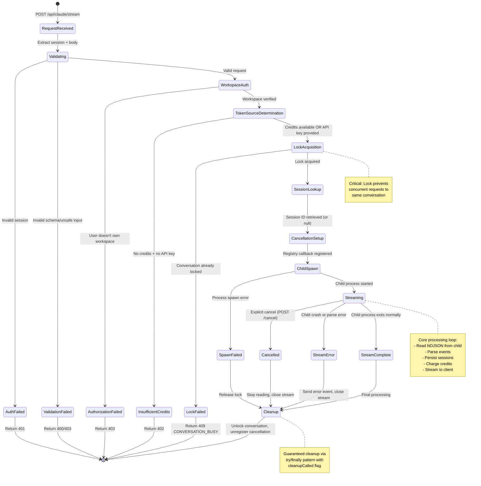

---

## 2. Conversation Locking State Machine

This diagram shows the detailed lock acquisition and release flow with timeout handling.

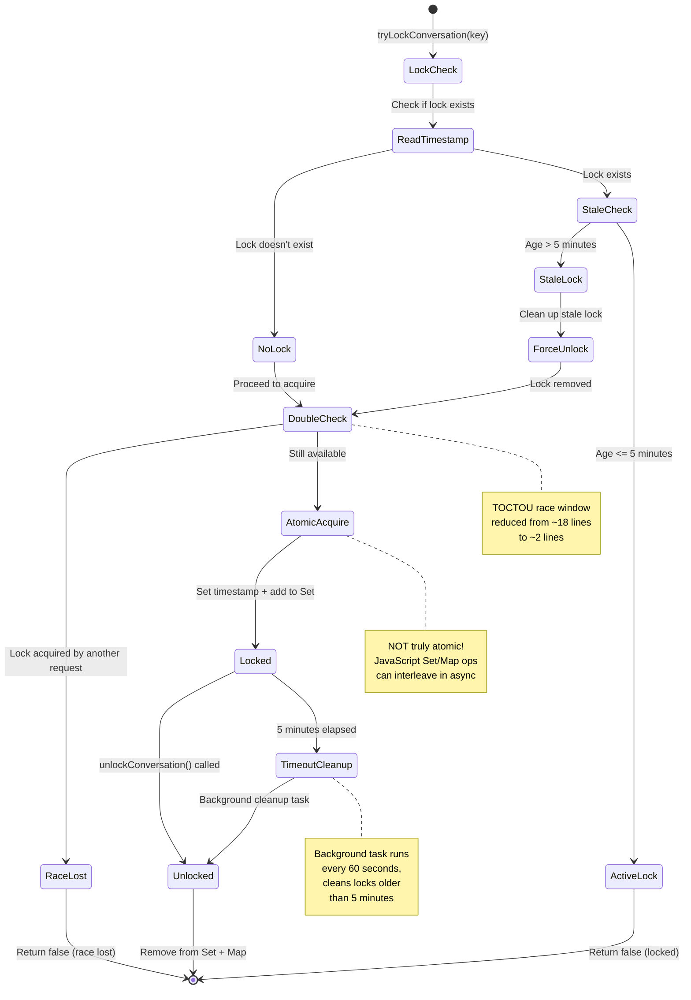

---

## 3. NDJSON Stream Processing State Machine

This diagram shows the streaming loop that processes child process output.

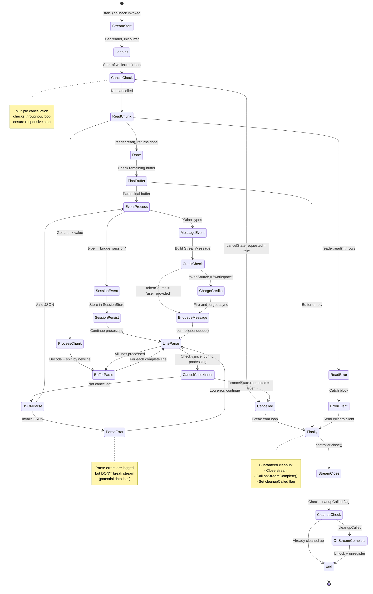

---

## 4. Cancellation Flow Sequence Diagram

This diagram shows the two cancellation paths and their timing.

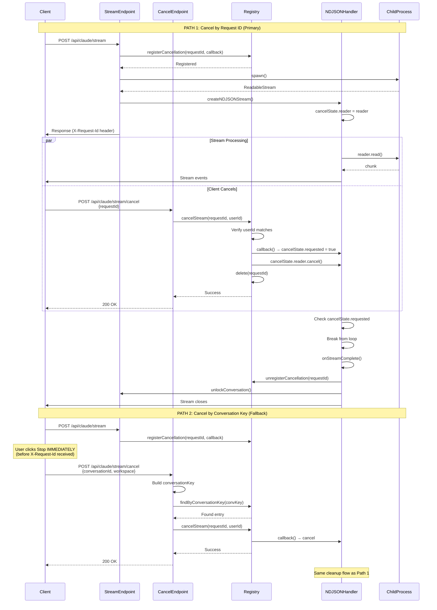

---

## 5. Credit Charging Flow Diagram

This diagram shows the async credit charging process and its potential failure modes.

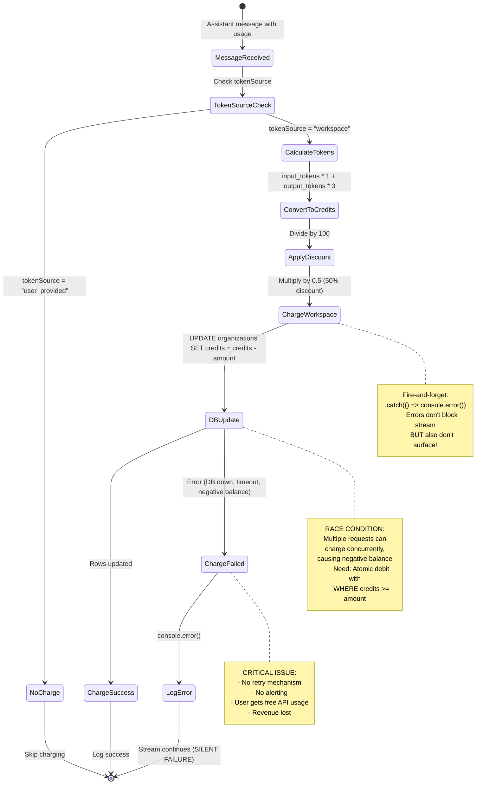

---

## 6. Session Persistence Flow Diagram

This diagram shows how sessions are stored and retrieved across requests.

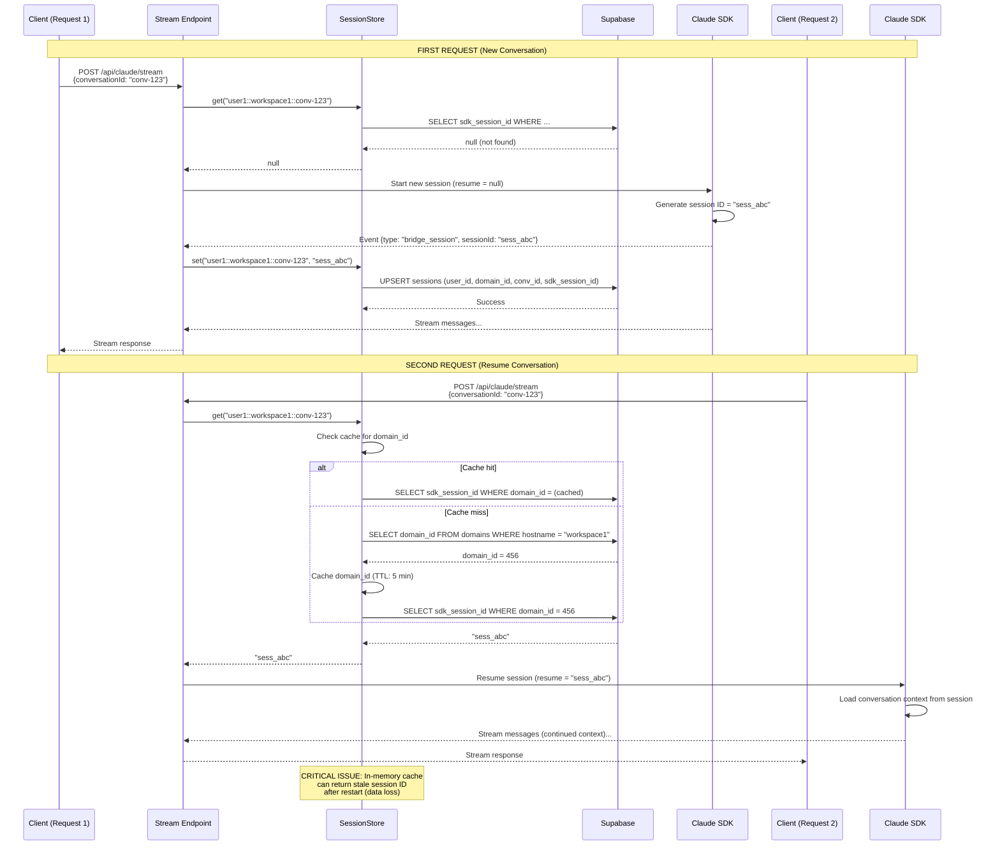

---

## 7. Child Process Lifecycle Diagram

This diagram shows the privilege separation and process management.

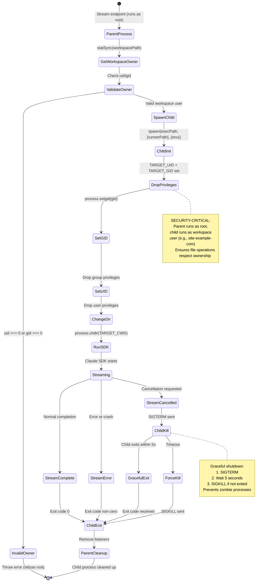

---

## 8. Error Handling Flow Chart

This diagram shows all error paths and their cleanup guarantees.

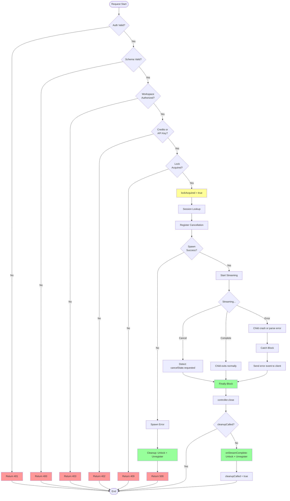

---

## 9. Lock Acquisition Race Condition Analysis

This diagram shows the TOCTOU (Time-of-Check to Time-of-Use) race window.

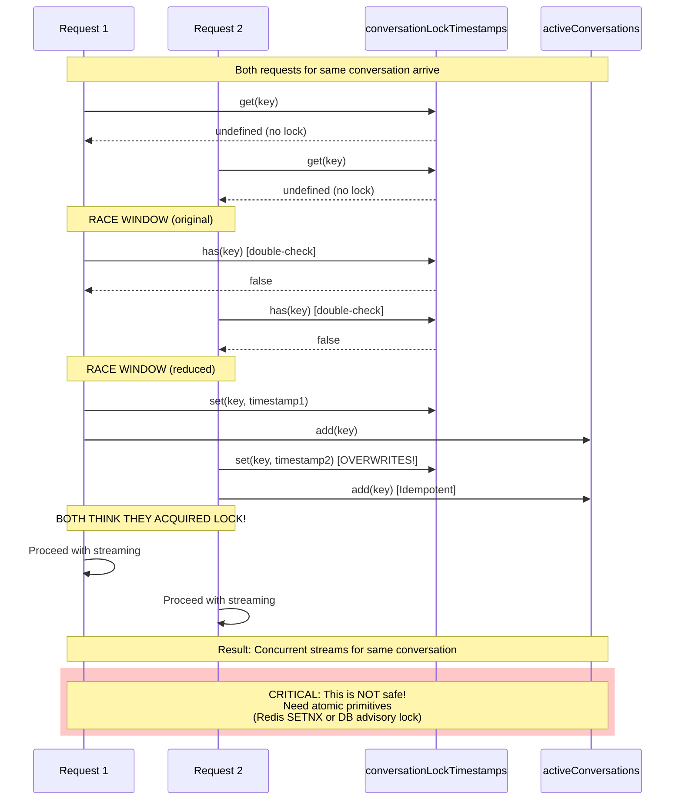

---

## 10. Component Interaction Overview

This diagram shows how all major components interact.

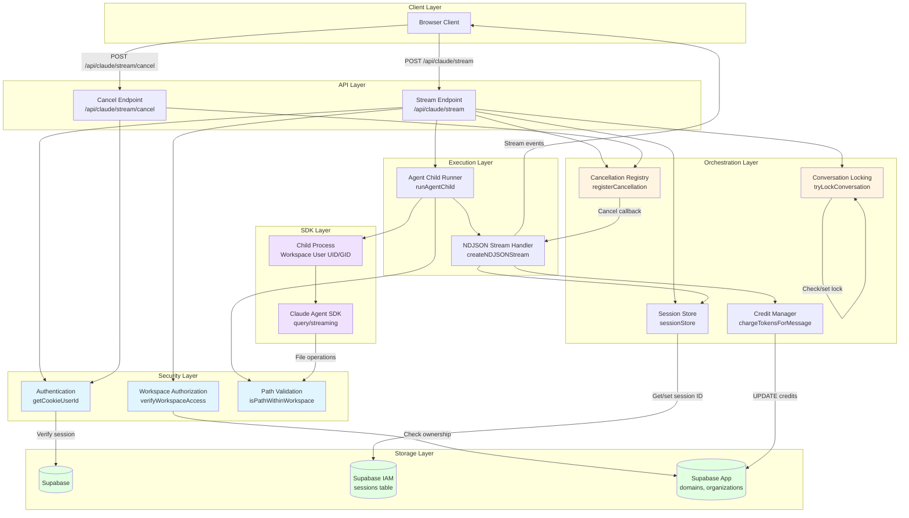

---

## 11. State Ownership Map

This diagram shows which component owns which state.

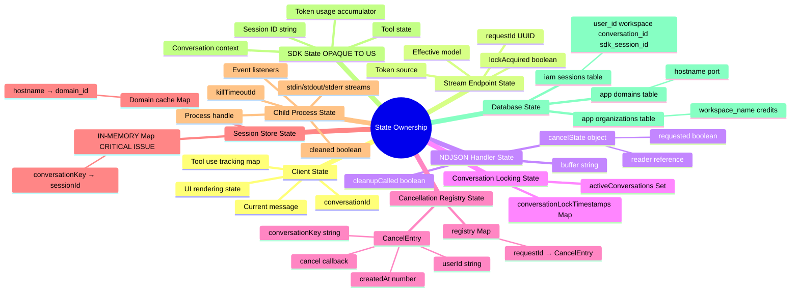

---

## Summary

These diagrams illustrate:

1. **Main Request State Machine**: Complete lifecycle with all transitions
2. **Conversation Locking**: Lock acquisition with TOCTOU race analysis
3. **NDJSON Stream Processing**: Core streaming loop with cancellation checks
4. **Cancellation Flow**: Two-path cancellation with timing
5. **Credit Charging**: Async charging with failure modes
6. **Session Persistence**: Storage and retrieval across requests
7. **Child Process Lifecycle**: Privilege separation and cleanup
8. **Error Handling**: All error paths with cleanup guarantees
9. **Lock Race Condition**: TOCTOU window visualization
10. **Component Interaction**: High-level architecture overview
11. **State Ownership**: Which component owns which state

**Key Insights from Diagrams**:

- ✅ **Multiple cleanup guarantees**: try/finally + cleanup flags prevent leaks
- ❌ **Lock race condition**: Double-check pattern reduces but doesn't eliminate TOCTOU
- ❌ **Credit charging can fail silently**: Fire-and-forget with no retry
- ✅ **Two cancellation paths**: Robust cancellation even during initialization
- ⚠️ **Complex state ownership**: Many components share state (works for single-process only)

These diagrams should be used alongside the analysis document for a complete understanding of the streaming architecture.
