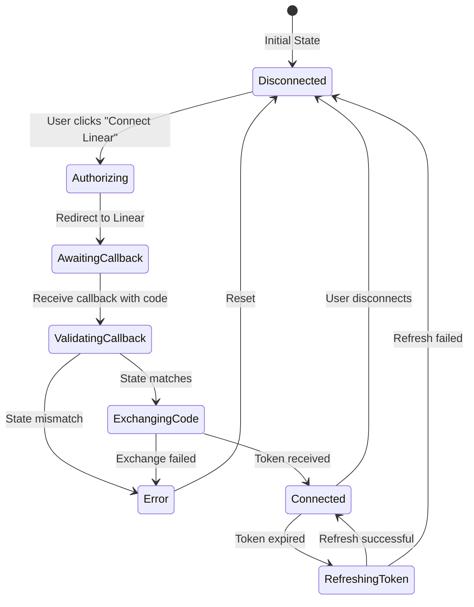

# Linear OAuth Integration - Flow & State Machine

## Overview

The Linear OAuth integration follows the OAuth 2.0 authorization code flow with PKCE-like state verification. This document describes the complete flow, state transitions, and error handling patterns.

## State Machine



## Detailed Flow

### 1. Initial Authorization Request

**Endpoint**: `GET /api/auth/linear`

**State**: `Disconnected → Authorizing`

**Process**:
1. User must be authenticated (via `requireSessionUser()`)
2. Validate Linear OAuth configuration exists
3. Generate CSRF state token (32 bytes, hex encoded)
4. Store state in HTTP-only cookie (10-minute TTL)
5. Build authorization URL with:
   - Client ID from environment
   - Redirect URI from environment
   - Scopes from `LINEAR_SCOPES`
   - State token for CSRF protection
6. Redirect user to Linear's authorization page

**Error Handling**:
- Missing configuration → Redirect to settings with error
- Authentication failure → 401 Unauthorized

### 2. OAuth Callback Handling

**Endpoint**: `GET /api/auth/linear?code=XXX&state=YYY`

**State**: `AwaitingCallback → ValidatingCallback → ExchangingCode`

**Process**:
1. Verify CSRF state token matches cookie
2. Clear state cookie immediately (prevent replay)
3. Exchange authorization code for tokens via oauth-core
4. Store tokens encrypted in database
5. Redirect to settings with success status

**Error Handling**:
- State mismatch → Redirect with "Invalid state" error
- Code exchange failure → Redirect with provider error message
- Missing credentials → Fall back to local disconnect

### 3. Token Management

#### Access Token Retrieval

**Method**: `oauth.getAccessToken(userId, provider)`

**State**: `Connected` (may transition to `RefreshingToken`)

**Process**:
1. Retrieve encrypted token blob from database
2. Parse and check expiration (5-minute buffer)
3. If expired:
   - Acquire refresh lock (prevents concurrent refreshes)
   - Double-check if another request already refreshed
   - Perform refresh if still expired
   - Save new tokens atomically
   - Release lock
4. Return valid access token

**Race Condition Prevention**:
```typescript
// OAuthManager owns its lockManager instance (no global singleton)
// Each manager creates its own lock manager via createRefreshLockManager()
// or accepts one via DI for testing

const oauth = new OAuthManager({
  // ... config
  lockManager: customLockManager, // Optional: inject for testing
  lockManagerConfig: { strategy: 'redis', redisUrl: process.env.REDIS_URL }
})

// Internally, getAccessToken() uses the instance's lock manager:
await this.lockManager.withLock(`${userId}:${provider}`, async () => {
  // Double-check pattern prevents unnecessary refreshes
  const recentToken = await checkRecentToken()
  if (stillValid(recentToken)) return recentToken.access_token

  // Perform actual refresh
  return await refreshToken()
})
```

### 4. Disconnection Flow

**Endpoint**: `DELETE /api/integrations/linear`

**State**: `Connected → Disconnected`

**Process**:
1. Verify user is connected
2. Attempt to revoke token with Linear API
3. Delete tokens from local database
4. Return success response

**Error Handling**:
- Not connected → 400 Bad Request
- Revocation fails → Still disconnect locally (Linear API might be down)
- Missing credentials → Disconnect locally only

## Security Considerations

### CSRF Protection
- Random 32-byte state token generated per authorization
- Stored in HTTP-only, secure, SameSite=lax cookie
- Validated before token exchange
- Cookie cleared immediately after validation

### Token Storage
- Tokens encrypted using AES-256-GCM
- Stored in `lockbox.user_secrets` table
- Row-level security enforced
- Service role required for access

### Refresh Token Security
- Mutex pattern prevents concurrent refreshes
- Double-check pattern avoids unnecessary API calls
- 5-minute expiry buffer prevents edge cases
- Stale lock cleanup after 30 seconds
- Distributed locking via Redis for multi-instance deployments (set `REDIS_URL`)

## Configuration

### Environment Variables
```bash
# OAuth Application Credentials
LINEAR_CLIENT_ID=lin_oauth_XXX
LINEAR_CLIENT_SECRET=XXX

# Redirect URI (auto-computed if not set)
LINEAR_REDIRECT_URI=https://terminal.goalive.nl/api/auth/linear

# Or computed from:
NEXT_PUBLIC_APP_URL=https://terminal.goalive.nl

# Distributed Locking (for multi-instance deployments)
REDIS_URL=redis://:password@host:6379
REFRESH_LOCK_STRATEGY=auto  # Options: "memory", "redis", "auto" (default)
# - "memory": In-memory only (single-instance deployments)
# - "redis": Force Redis (requires REDIS_URL)
# - "auto": Use Redis if REDIS_URL set, otherwise memory with warning
```

### Per-Environment Configuration
- Development: `dev.terminal.goalive.nl`
- Staging: `staging.terminal.goalive.nl`
- Production: `terminal.goalive.nl`

Each environment requires its own redirect URI registered in Linear's OAuth app settings.

## Error States

### User-Facing Errors
1. **Configuration Missing**: "Linear OAuth not configured"
2. **State Mismatch**: "Invalid state" (possible CSRF attack)
3. **Token Expired**: "User must re-authenticate"
4. **Provider Error**: Passed through from Linear API

### Internal Errors (Logged)
1. **Lock Timeout**: Refresh lock held > 30 seconds
2. **Parse Errors**: Malformed token data
3. **Network Errors**: Linear API unreachable
4. **Database Errors**: Supabase connection issues

## Testing Strategies

### Unit Tests
- Token refresh lock manager
- CSRF state generation/validation
- Token expiry calculations
- Error handling paths

### Integration Tests
```typescript
describe('Linear OAuth Flow', () => {
  it('should complete full authorization flow', async () => {
    // 1. Initiate authorization
    const authResponse = await request('/api/auth/linear')
    expect(authResponse.status).toBe(302)
    expect(authResponse.headers.location).toContain('linear.app')

    // 2. Simulate callback
    const state = extractStateFromCookie(authResponse)
    const callbackResponse = await request(
      `/api/auth/linear?code=test_code&state=${state}`
    )
    expect(callbackResponse.status).toBe(302)
    expect(callbackResponse.headers.location).toContain('status=success')

    // 3. Verify connection
    const statusResponse = await request('/api/integrations/linear')
    expect(statusResponse.body.connected).toBe(true)
  })
})
```

### Manual Testing Checklist
- [ ] Click "Connect Linear" → redirects to Linear
- [ ] Authorize in Linear → redirects back with success
- [ ] Check connection status → shows connected
- [ ] Use Linear integration → API calls succeed
- [ ] Token expires → automatically refreshes
- [ ] Disconnect → revokes and cleans up
- [ ] Multiple concurrent requests → no race conditions
- [ ] Invalid state → shows error, doesn't connect

## Monitoring & Observability

### Key Metrics
- Authorization success rate
- Token refresh frequency
- Refresh lock contention
- API error rates
- Average response times

### Logging Points
```typescript
console.log('[Linear OAuth] Redirecting to Linear:', userId)
console.log('[Linear OAuth] Successfully connected:', userId)
console.error('[Linear OAuth] State mismatch:', { saved, received })
console.log('[RefreshLock] Starting new refresh:', lockKey)
console.warn('[Linear OAuth] Token revocation failed:', error)
```

## Maintenance Notes

### Common Issues
1. **"Invalid state" errors**: Check cookie settings, ensure SameSite and domain match
2. **Refresh loops**: Verify token expiry logic and buffer time
3. **Lock timeouts**: Check for hanging refresh operations
4. **Connection failures**: Verify redirect URI matches Linear app settings

### Future Improvements
1. ~~Implement distributed locks for multi-instance deployments (Redis)~~ **DONE** - Set `REDIS_URL` and `REFRESH_LOCK_STRATEGY`
2. Add webhook support for real-time Linear events
3. Implement token rotation for enhanced security
4. Add metrics collection for monitoring
5. Create admin UI for troubleshooting connections