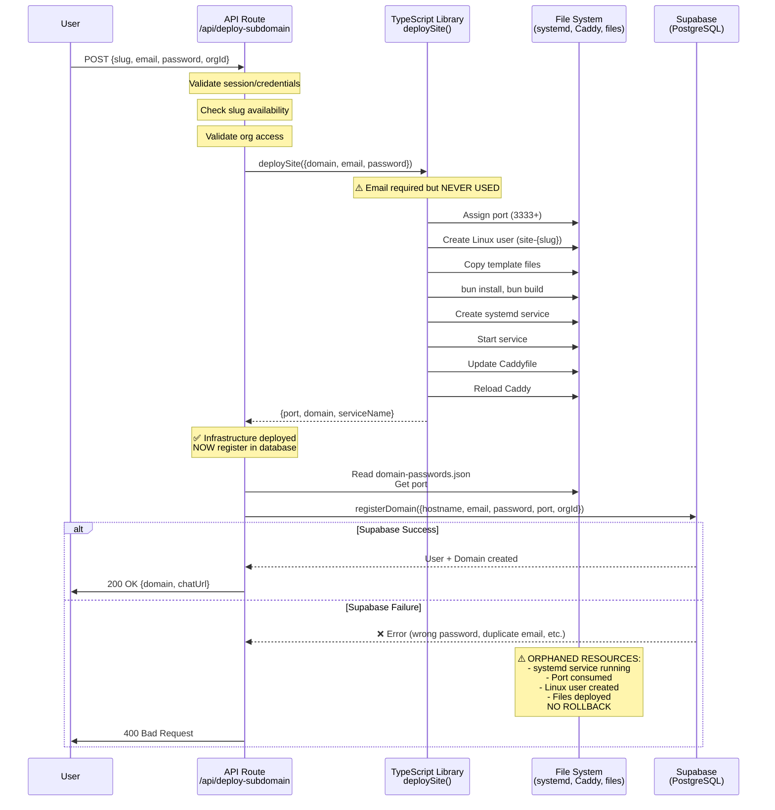

# Current Deployment Architecture (As-Is)

**Status:** Production system with known architectural issues. Refactoring planned.

**Complete Problem Analysis:** [REFACTORING_PROBLEM_STATEMENT.md](./REFACTORING_PROBLEM_STATEMENT.md)

---

## Overview

The WebAlive platform deploys isolated websites through a multi-layered architecture:

- **API Layer**: Handles HTTP requests, authentication, orchestration
- **Infrastructure Layer**: Creates Linux users, systemd services, Caddy config
- **Database Layer**: Stores users, orgs, domains in Supabase PostgreSQL
- **File Registry**: JSON-based port assignments in `domain-passwords.json`

**Key Characteristic:** Infrastructure is deployed BEFORE database registration, leading to orphaned resources on failures.

---

## High-Level Flow Diagram



---

## Component Responsibilities

### 1. API Route: `/api/deploy-subdomain`

**File:** `apps/web/app/api/deploy-subdomain/route.ts`

**Responsibilities:**
- Authenticate user (JWT session or email/password)
- Validate org access
- Check slug availability
- Orchestrate deployment flow
- Handle errors and return responses

**State Machine:** 30+ states documented in [REFACTORING_PROBLEM_STATEMENT.md](./REFACTORING_PROBLEM_STATEMENT.md#system-1-api-route-post-apideploy-subdomain)

**Key Issue:** Calls `deploySite()` BEFORE `registerDomain()`, no rollback on database failure.

---

### 2. TypeScript Deploy Library

**File:** `packages/deploy-scripts/src/orchestration/deploy.ts`

**Function:** `deploySite(config: DeploymentConfig): Promise<DeploymentResult>`

**Responsibilities:**
- DNS validation (if not wildcard `*.alive.best`)
- Port assignment (read/write `domain-passwords.json`)
- Linux user creation (`useradd --system`)
- Workspace setup (copy template, set permissions)
- Dependency installation (`bun install`)
- Build execution (`bun run build`)
- systemd service deployment
- Caddy configuration update

**State Machine:** 40+ states documented in [REFACTORING_PROBLEM_STATEMENT.md](./REFACTORING_PROBLEM_STATEMENT.md#system-2-typescript-deploy-library-deploysite)

**Key Issue:** Requires `config.email` parameter but NEVER uses it (validation only).

---

### 3. Bash Script (Manual Deployments)

**File:** `scripts/sites/deploy-site-systemd.sh`

**Usage:** `DEPLOY_EMAIL=user@example.com ./scripts/sites/deploy-site-systemd.sh example.com`

**Responsibilities:**
- Email validation (exit 17 if missing)
- Password hashing with bcrypt (exit 16 if fails)
- DNS validation (exit 12 if fails)
- Port assignment (exit 15 if exhausted)
- Full infrastructure deployment (same as TypeScript)

**State Machine:** 194 states across 6 phases, fully documented in [site-deployment-state-machine.md](./site-deployment-state-machine.md)

**Key Difference:** Self-contained auth handling (validates email, hashes password) vs TypeScript which expects auth handled elsewhere.

**Status:** NOT used by API, available for manual sysadmin deployments.

---

## Data Flows

### Email/Password Through the System

```
User Input
  ↓
API: {email, password}
  ↓
deploySite({email, password})  ← Email validated (truthy check), never used
  ↓
(Infrastructure deployed with no email reference)
  ↓
registerDomain({email, password})  ← Actually uses email/password
  ↓
Supabase: Check/create user, hash password, store
```

**Problem:** Email/password travel through infrastructure layer but infrastructure never uses them.

---

### Port Assignment Flow

```
TypeScript: getOrAssignPort(domain)
  ↓
Read: domain-passwords.json (path from SERVER_CONFIG_PATH)
  ↓
Domain exists?
  YES → Reuse port
  NO  → Find max port, increment, write to JSON
  ↓
Port returned to deploySite()
  ↓
Used in: systemd env file, Caddyfile
  ↓
(Later) API reads port from JSON
  ↓
API writes port to Supabase: app.domains.port
```

**Problem:** Port exists in TWO places (JSON + Supabase), written at different times, no sync mechanism.

---

## Configuration Files

### Port Registry

**Location:** `domain-passwords.json` (path derived from `SERVER_CONFIG_PATH` env var / `server-config.json`)

**Format:**
```json
{
  "example.alive.best": {
    "port": 3333
  },
  "another.alive.best": {
    "port": 3334
  }
}
```

**Management:**
- Written by: TypeScript `getOrAssignPort()`, Bash `get_next_port()`
- Read by: API route, TypeScript library, Bash script
- Auto-increment: max + 1, starting from 3333
- Range: 3333-3999 (safety limit)
- Atomic writes: `.tmp` file + `mv`

---

### Caddy Configuration

**Location:** `/root/alive/Caddyfile`

**Per-domain block:**
```
example.alive.best {
    import common_headers
    import image_serving
    reverse_proxy localhost:3333 {
        header_up Host {host}
        header_up X-Real-IP {remote_host}
        header_up X-Forwarded-For {remote_host}
        header_up X-Forwarded-Proto {scheme}
    }
}
```

**Update mechanism:**
- File locking (30s timeout) prevents concurrent writes
- Check if domain exists → update port with `sed`
- If new → append block
- `systemctl reload caddy` for zero-downtime

---

### systemd Service

**Template:** `/etc/systemd/system/site@.service`

**Environment File:** `/etc/sites/{slug}.env`
```bash
DOMAIN=example.alive.best
PORT=3333
```

**Service name pattern:** `site@example-alive-best.service`

---

## Database Schema (Supabase)

### IAM Schema (Authentication)

```sql
-- Users
CREATE TABLE iam.users (
    user_id uuid PRIMARY KEY,
    email text UNIQUE NOT NULL,
    password_hash text NOT NULL,  -- bcrypt
    status text DEFAULT 'active',
    created_at timestamp DEFAULT now()
);

-- Organizations
CREATE TABLE iam.orgs (
    org_id uuid PRIMARY KEY,
    name text NOT NULL,
    credits integer DEFAULT 0,  -- Per-org (not per-domain)
    created_at timestamp DEFAULT now()
);

-- Org Memberships
CREATE TABLE iam.org_memberships (
    org_id uuid REFERENCES iam.orgs(org_id),
    user_id uuid REFERENCES iam.users(user_id),
    role text NOT NULL,  -- 'owner' or 'member'
    PRIMARY KEY (org_id, user_id)
);
```

### App Schema (Domains)

```sql
CREATE TABLE app.domains (
    hostname text PRIMARY KEY,
    port integer NOT NULL,  -- ⚠️ Also in domain-passwords.json
    org_id uuid REFERENCES iam.orgs(org_id),
    created_at timestamp DEFAULT now()
);
```

**Relationships:**
- User → owns → Org (via `org_memberships.role = 'owner'`)
- Org → owns → Domains (via `app.domains.org_id`)
- Credits at **org level** (all domains in org share credits)

---

## Known Issues Summary

### 1. Ordering Problem: Infrastructure Before Auth

**Current:** API → deploySite() → registerDomain()

**Problem:** If `registerDomain()` fails after `deploySite()` succeeds:
- systemd service running
- Port consumed in registry
- Linux user created
- Files deployed
- **No rollback mechanism**

**Example Failure:** User provides wrong password for existing account → infrastructure orphaned.

---

### 2. Mixed Concerns: Unused Email Parameter

**Current:** `deploySite({domain, email, password, orgId})`

**Problem:**
- TypeScript library requires `email` (line 62-64 validation)
- Email is NEVER used (only passed through to `registerDomain()`)
- Creates false dependency
- Can't test infrastructure without providing fake email

---

### 3. Dual Implementation: TypeScript vs Bash

**TypeScript:**
- 205 lines, 40+ states
- Used by API
- Validates email exists, but doesn't use it

**Bash:**
- 408 lines, 194 states across 6 phases
- NOT used by API (manual only)
- Self-contained auth (validates email, hashes password)

**Problem:**
- Maintenance burden (keep both in sync)
- Feature parity (bash has email validation, TypeScript doesn't)
- Documentation split (bash has detailed state machine)

---

### 4. Port Registry vs Supabase Divergence

**Two sources of truth:**

1. **JSON:** `domain-passwords.json` (path from `SERVER_CONFIG_PATH` env var)
   - Written during `deploySite()` (before Supabase)

2. **Database:** `app.domains.port`
   - Written during `registerDomain()` (after infrastructure)

**Problem:**
- No sync mechanism
- If Supabase fails, JSON has port but database doesn't
- Monitoring may query database and get stale/missing data

---

### 5. No Rollback Mechanism

**Current error handling:**
- TypeScript library throws `DeploymentError` on failure
- API catches error and returns 400/500
- No cleanup of partial state

**Missing rollbacks:**
- If build fails → user/files persist
- If Caddy fails → service running but unreachable
- If Supabase fails → infrastructure fully deployed
- If port check fails → service may actually be working

---

### 6. Concurrent Deployment Conflicts

**Locking:**
- Caddy file: `flock` with 30s timeout
- Port registry: None (relies on atomic `.tmp` + `mv`)
- systemd: None

**Race conditions:**
- Port assignment: Two deployments read max simultaneously → assign same port
- User creation: Two deployments call `useradd` for same user → second fails
- Caddy lock: First acquires, second times out (deployment fails)

**Mitigation:** File-level primitives only, no distributed locking (Redis, etc.).

---

## References to Detailed Documentation

**Complete State Machines:**
- [API Route (30+ states)](./REFACTORING_PROBLEM_STATEMENT.md#system-1-api-route-post-apideploy-subdomain)
- [TypeScript Library (40+ states)](./REFACTORING_PROBLEM_STATEMENT.md#system-2-typescript-deploy-library-deploysite)
- [Bash Script (194 states, 6 phases)](./site-deployment-state-machine.md)

**Interaction Flow:**
- [Sequence Diagram](./REFACTORING_PROBLEM_STATEMENT.md#interaction-diagram-current-flow)

**Database Schema:**
- [Complete Schema](./REFACTORING_PROBLEM_STATEMENT.md#database-schema-supabase-postgresql)

**Configuration Details:**
- [Port Registry](./REFACTORING_PROBLEM_STATEMENT.md#port-registry-file-based)
- [Caddy Config](./REFACTORING_PROBLEM_STATEMENT.md#caddy-configuration)
- [systemd Template](./REFACTORING_PROBLEM_STATEMENT.md#systemd-unit-template)

**Problem Analysis:**
- [6 Detailed Pain Points](./REFACTORING_PROBLEM_STATEMENT.md#current-pain-points-detailed)
- [Hidden Assumptions](./REFACTORING_PROBLEM_STATEMENT.md#hidden-assumptions)
- [Dependents & Consumers](./REFACTORING_PROBLEM_STATEMENT.md#dependents--consumers)

**Solution Exploration:**
- [Questions for Oracle](./REFACTORING_PROBLEM_STATEMENT.md#questions-for-the-oracle)
- [Success Criteria](./REFACTORING_PROBLEM_STATEMENT.md#success-criteria)
- [Solution Space](./REFACTORING_PROBLEM_STATEMENT.md#solution-space-for-oracle-consideration)

---

## End-to-End Architecture

For the complete deployment flow from user input to running site, see [site-deployment-architecture.md](./site-deployment-architecture.md).

For operational details (monitoring, troubleshooting, commands), see [site-deployment-architecture.md](./site-deployment-architecture.md).

---

## Next Steps

A refactoring is being planned to address these architectural issues. The goal is to:

1. **Separate concerns** - Infrastructure should not require auth credentials
2. **Fix ordering** - Decide auth-first or infrastructure-first with proper rollback
3. **Single source of truth** - Resolve port registry vs database divergence
4. **Improve error handling** - Implement rollback for partial failures
5. **Consolidate implementations** - Reduce maintenance burden

See [REFACTORING_PROBLEM_STATEMENT.md](./REFACTORING_PROBLEM_STATEMENT.md) for complete problem analysis and solution exploration.
