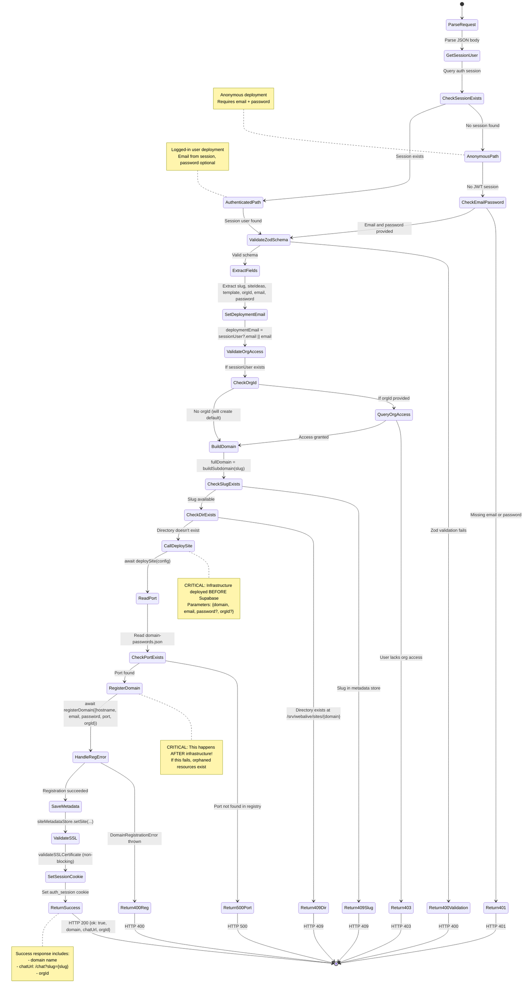
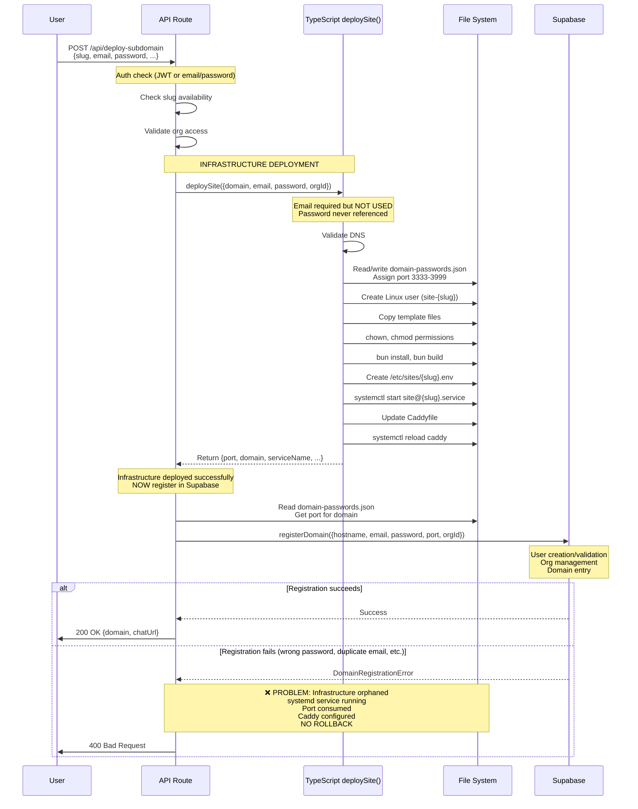

# Deployment Architecture Refactoring: Complete Problem Statement

## Context: Multi-Tenant Website Hosting Platform

We operate a platform that deploys isolated websites for multiple users. Each deployment:
- Creates a dedicated Linux system user (e.g., `site-example-com`)
- Sets up workspace at `/srv/webalive/sites/{domain}/`
- Assigns unique port (3333+)
- Configures systemd service for process isolation
- Updates Caddy reverse proxy for HTTPS
- Registers domain/user in PostgreSQL (Supabase)

**Current Scale**: ~10-50 sites, growing

---

## THE PROBLEM: Mixed Concerns in Deployment Flow

### High-Level Issue

**Authentication and infrastructure concerns are TANGLED across three layers:**

1. API Layer receives email/password
2. Infrastructure deployment (TypeScript) receives email/password but doesn't use it
3. Supabase registration happens AFTER infrastructure is deployed

**Result**: If Supabase registration fails (wrong password, duplicate email), infrastructure is already deployed with no rollback mechanism.

---

## COMPLETE STATE MACHINES OF CURRENT SYSTEM

### System 1: API Route (`POST /api/deploy-subdomain`)



**Key Observations**:
1. Line 135-140: `deploySite()` called with email/password
2. Line 154-176: `registerDomain()` happens AFTER infrastructure
3. No rollback if registration fails after infrastructure succeeds
4. Email/password travel through API → deploySite → (unused) → registerDomain

---

### System 2: TypeScript Deploy Library (`deploySite()`)

```mermaid
stateDiagram-v2
    [*] --> CheckEmailRequired

    CheckEmailRequired --> ThrowEmailError: config.email is falsy
    CheckEmailRequired --> LowercaseDomain: Email provided

    ThrowEmailError --> [*]: Throw DeploymentError

    note left of CheckEmailRequired
        Email is required but NOT USED
        Only for validation, passed to registerDomain later
    end note

    LowercaseDomain --> ValidateTemplate: domain = config.domain.toLowerCase()

    ValidateTemplate --> CheckWildcard: Remove circular symlinks from template

    CheckWildcard --> SkipDNS: shouldSkipDNSValidation(domain) = true
    CheckWildcard --> ValidateDNS: Custom domain

    note left of ValidateDNS
        DNS validation (if not wildcard):
        - dig +short for A record
        - Check points to YOUR_SERVER_IP
        - Detect Cloudflare proxy IPs
        - Throw error if proxied or wrong IP
    end note

    SkipDNS --> AssignPort
    ValidateDNS --> AssignPort: DNS valid

    note right of AssignPort
        Port assignment:
        - Read domain-passwords.json
        - If domain exists: reuse port
        - If new: find max + 1, starting from 3333
        - Check netstat for actual usage
        - Write atomically (.tmp + mv)
    end note

    AssignPort --> CreateSlug: port = await getOrAssignPort(domain)
    CreateSlug --> GetUsername: slug = domain.replace(/[^a-z0-9]+/gi, "-")
    GetUsername --> EnsureUser: siteUser = "site-" + slug

    note left of EnsureUser
        Create system user:
        - useradd --system --home-dir /srv/webalive/sites/{domain}
        - passwd -l (lock password)
    end note

    EnsureUser --> SetupDirectories: Create Linux user if doesn't exist

    note right of SetupDirectories
        Directory setup:
        - Create /srv/webalive/sites/{domain}/
        - Copy from template or existing site
        - chown -R {siteUser}:{siteUser}
        - chmod 750
    end note

    SetupDirectories --> CreateCaddyfile: Copy template files

    CreateCaddyfile --> FindConfigScript: Create site-specific Caddyfile with port
    FindConfigScript --> ThrowConfigMissing: Config script doesn't exist
    FindConfigScript --> RunConfigGen: scripts/generate-config.js exists

    ThrowConfigMissing --> [*]: Throw DeploymentError

    RunConfigGen --> ThrowConfigFailed: spawnSync bun script failed
    RunConfigGen --> FixOwnership: Config generated successfully

    ThrowConfigFailed --> [*]: Throw DeploymentError

    FixOwnership --> BunInstall: chown -R {siteUser}:{siteUser}

    BunInstall --> ThrowInstallFailed: sudo -u {siteUser} bun install failed
    BunInstall --> FixBinPerms: Dependencies installed

    ThrowInstallFailed --> [*]: Throw DeploymentError

    FixBinPerms --> BunBuild: chmod a+x node_modules/.bin/* and esbuild

    BunBuild --> ThrowBuildFailed: sudo -u {siteUser} bun run build failed
    BunBuild --> StopPM2: Build succeeded

    ThrowBuildFailed --> [*]: Throw DeploymentError

    StopPM2 --> CreateEnvFile: Stop old PM2 process if exists

    note right of CreateEnvFile
        Create /etc/sites/{slug}.env:
        DOMAIN={domain}
        PORT={port}
    end note

    CreateEnvFile --> ReloadSystemd: Write env file

    ReloadSystemd --> StartService: systemctl daemon-reload
    StartService --> Delay3s: systemctl start site@{slug}.service

    Delay3s --> VerifyService: Wait 3 seconds
    VerifyService --> ThrowNotActive: systemctl is-active failed
    VerifyService --> Delay2s: Service is active

    ThrowNotActive --> [*]: Throw DeploymentError

    Delay2s --> CheckPort: Wait 2 seconds

    note right of CheckPort
        Port verification with retries:
        - netstat -tuln | grep :{port}
        - 3 retries with 2s delays
        - Allows Vite time to start
    end note

    CheckPort --> RetryPort: Port not listening (retries left)
    CheckPort --> ThrowPortFailed: Port not listening (no retries)
    CheckPort --> UpdateCaddyfile: Port is listening

    RetryPort --> CheckPort: Wait 2s and retry

    ThrowPortFailed --> [*]: Throw DeploymentError + journalctl logs

    UpdateCaddyfile --> ReloadCaddy: Update main Caddyfile with domain block

    note left of UpdateCaddyfile
        Caddyfile update:
        - Check if domain exists
        - If exists: update port with sed
        - If new: append domain block
    end note

    ReloadCaddy --> FinalDelay: systemctl reload caddy
    FinalDelay --> CurlTest: Wait 2 seconds

    CurlTest --> ReturnSuccess: curl -f -s -I https://{domain} (non-blocking)

    ReturnSuccess --> [*]: Return {domain, port, serviceName, siteUser, siteDirectory, envFile, success: true}

    note right of ReturnSuccess
        SUCCESS: Infrastructure fully deployed
        - systemd service running
        - Port listening
        - Caddy routing configured
        - HTTPS (eventually) working

        email/password were NEVER USED
    end note
```



**Key Observations**:
1. Line 62-64: Requires `config.email` but NEVER uses it (validation only)
2. `config.password` is also unused (passed through from API, intended for Supabase)
3. Line 77: Port assigned and written to `domain-passwords.json`
4. Lines 152-186: Service deployment and verification
5. Returns infrastructure state, no Supabase interaction

---

### System 3: Bash Script (`deploy-site-systemd.sh`) - UNUSED BY API

**Full state machine**: See `docs/deployment/site-deployment-state-machine.md` (6 phases, 408 lines, fully documented)

**Summary of phases**:
1. **Phase 1 (Lines 24-118)**: Variable setup, **email validation (exit 17)**, **password hashing (exit 16)**, DNS validation (exit 12)
2. **Phase 2 (Lines 120-198)**: Port assignment with `get_next_port()` function
3. **Phase 3 (Lines 209-258)**: User creation, workspace setup, file copying
4. **Phase 4 (Lines 260-293)**: Config generation, deps install, build
5. **Phase 5 (Lines 295-335)**: systemd service deployment
6. **Phase 6 (Lines 337-408)**: Caddy configuration with file locking

**Key difference from TypeScript library**:
- Bash script DOES email validation and password hashing (lines 40-59)
- Uses `DEPLOY_EMAIL` and `DEPLOY_PASSWORD` env vars
- Intended to be self-contained (auth + infrastructure)
- **Currently not used by API** (superseded by TypeScript library)

---

## INTERACTION DIAGRAM: Current Flow



**Critical Problem Illustrated**:
- Infrastructure deployment (Steps 3-12) happens BEFORE Supabase registration (Step 14)
- If Supabase fails, infrastructure remains deployed
- No cleanup mechanism for orphaned resources

---

## DATABASE SCHEMA (Supabase PostgreSQL)

### IAM Schema (Authentication & Organizations)

```sql
-- Users table
CREATE TABLE iam.users (
    user_id uuid PRIMARY KEY DEFAULT gen_random_uuid(),
    email text UNIQUE NOT NULL,
    password_hash text NOT NULL,  -- bcrypt hash
    status text NOT NULL DEFAULT 'active',
    is_test_env boolean DEFAULT false,
    metadata jsonb DEFAULT '{}'::jsonb,
    created_at timestamp DEFAULT now()
);

-- Organizations table
CREATE TABLE iam.orgs (
    org_id uuid PRIMARY KEY DEFAULT gen_random_uuid(),
    name text NOT NULL,
    credits integer DEFAULT 0,  -- Per-org credits (not per-domain)
    created_at timestamp DEFAULT now()
);

-- Org memberships (many-to-many: users ↔ orgs)
CREATE TABLE iam.org_memberships (
    org_id uuid REFERENCES iam.orgs(org_id),
    user_id uuid REFERENCES iam.users(user_id),
    role text NOT NULL,  -- 'owner' or 'member'
    PRIMARY KEY (org_id, user_id)
);
```

### App Schema (Domains & Infrastructure)

```sql
-- Domains table
CREATE TABLE app.domains (
    hostname text PRIMARY KEY,
    port integer NOT NULL,
    org_id uuid REFERENCES iam.orgs(org_id),
    created_at timestamp DEFAULT now()
);
```

**Key Relationships**:
- User → owns → Org (via `org_memberships.role = 'owner'`)
- Org → owns → Domains (via `app.domains.org_id`)
- Credits tracked at **org level** (not per-domain)

---

## PORT REGISTRY (File-Based)

**Location**: `domain-passwords.json` (path derived from `SERVER_CONFIG_PATH` env var / `server-config.json`)

**Format**:
```json
{
  "example.alive.best": {
    "port": 3333
  },
  "another.alive.best": {
    "port": 3334
  }
}
```

**Management**:
- Read by: TypeScript library, bash script, API route
- Written by: TypeScript `getOrAssignPort()` function
- Auto-increment: Finds max port, adds 1, starting from 3333
- Port range: 3333-3999 (safety limit)
- Conflict detection: Checks `netstat -tuln` for actual usage
- Atomic writes: Uses `.tmp` file + `mv` for safety
- **No synchronization with Supabase `app.domains.port`**

**Assumption**: JSON file is faster and more reliable than DB queries for port lookups

---

## CONFIGURATION FILES

### Caddy Configuration

**Main file**: `/root/alive/Caddyfile`

**Format** (per domain):
```
example.alive.best {
    import common_headers
    import image_serving
    reverse_proxy localhost:3333 {
        header_up Host {host}
        header_up X-Real-IP {remote_host}
        header_up X-Forwarded-For {remote_host}
        header_up X-Forwarded-Proto {scheme}
    }
}
```

**Update mechanism**:
- File locking (30-second timeout) prevents concurrent corruption
- Check if domain exists → update port with `sed`
- If new domain → append block
- `systemctl reload caddy` for zero-downtime reload

### systemd Unit Template

**File**: `/etc/systemd/system/site@.service`

```ini
[Unit]
Description=WebAlive Site: %i
After=network.target

[Service]
Type=simple
User=site-%i
WorkingDirectory=/srv/webalive/sites/%i/
ExecStart=/usr/local/bin/bun user/index.ts
EnvironmentFile=/etc/sites/%i.env
Restart=always
RestartSec=10

# Security hardening
ProtectSystem=strict
ProtectHome=yes
NoNewPrivileges=yes
PrivateTmp=yes
ReadWritePaths=/srv/webalive/sites/%i/

# Resource limits
MemoryLimit=512M
CPUQuota=50%
LimitNOFILE=1024

[Install]
WantedBy=multi-user.target
```

**Environment File**: `/etc/sites/{slug}.env`

```bash
DOMAIN=example.alive.best
PORT=3333
```

**Usage**:
- Service name: `site@example-alive-best.service`
- `%i` replaced with slug (domain with hyphens)
- Reads port from environment file
- Runs as dedicated system user

---

## HIDDEN ASSUMPTIONS

1. **Port Registry is Single Source of Truth**
   - Assumption: JSON file lookups faster than Supabase queries
   - Reality: Port exists in TWO places (JSON + `app.domains.port`)
   - No sync mechanism if they diverge

2. **User Exists OR Will Be Created**
   - JWT session → user definitely exists in Supabase
   - Email/password → might be new user OR existing login
   - `registerDomain()` handles both cases transparently

3. **Organizations Auto-Created**
   - First deployment → creates default org named `{email}'s Organization`
   - Subsequent deployments → uses existing default org OR specified orgId
   - Assumption: Every user has at least one org (no orphan users)

4. **DNS Pre-Validated for Wildcard**
   - `*.alive.best` → skip DNS checks (we control wildcard)
   - Custom domains → must point to `YOUR_SERVER_IP` (no Cloudflare proxy orange cloud)
   - Assumption: Wildcard DNS configured correctly at registrar

5. **Concurrent Deployments Won't Conflict**
   - Multiple simultaneous deployments possible
   - Caddy file locking prevents corruption
   - Port assignment checks actual netstat usage
   - Assumption: File locking + port checks sufficient (no Redis/distributed locks)

6. **Infrastructure Idempotent (Mostly)**
   - Re-deploying same domain → updates configuration
   - Assumption: `useradd` won't fail if user exists
   - Assumption: Caddy block update with `sed` safe
   - Reality: Some operations not truly idempotent (e.g., partial failures)

7. **Bash Script Still Valid for Manual Use**
   - API uses TypeScript library
   - Bash script exists and is fully functional
   - Assumption: Sysadmins might use bash script directly
   - Can't delete without migration plan

8. **Email Required for Deployment**
   - TypeScript library validates `config.email` is truthy
   - But never actually USES the email
   - Assumption: Email needed for "future Supabase registration"
   - Reality: Email only needed for API → Supabase, not infrastructure

---

## DEPENDENTS & CONSUMERS

### What Depends on Current Flow

**API Route Consumers**:
- Web UI deployment form (primary user path)
- Potential future CLI tool
- Potential future webhook integrations (GitHub, etc.)

**TypeScript Deploy Library Consumers**:
- API route (only current user)
- Backup scripts (uses `backupWebsites()` from same package)
- Future: Batch deployment tools, migration scripts

**Supabase Schema Consumers**:
- Authentication system (reads `iam.users.password_hash` for login)
- Credits system (reads/writes `iam.orgs.credits`)
- Domain listing API (`GET /api/domains` joins app.domains + iam.orgs + iam.users)
- Organization dashboard (shows org members, domains, credits)

**Port Registry Consumers**:
- TypeScript `getOrAssignPort()` (read/write)
- Bash script `get_next_port()` (read/write)
- API route `getPortFromRegistry()` (read-only)
- Monitoring scripts that verify port usage
- Port conflict resolution tools

**systemd Services**:
- Each site depends on environment file having correct `PORT`
- Caddy depends on services listening on correct ports
- Monitoring depends on service names matching domain slugs
- Logs queried via `journalctl -u site@{slug}.service`

---

## USER REQUIREMENTS & WISHES

### What Users Want to Achieve

1. **Separation of Concerns**
   - Authentication logic separate from infrastructure deployment
   - Infrastructure script should work without email/password parameters
   - Easier to test infrastructure independently of auth
   - Clearer code boundaries and responsibilities

2. **Maintain API Integration**
   - API should continue orchestrating full deployment flow
   - End users should see no behavior change
   - API handles auth → Supabase → infrastructure → success

3. **Keep Supabase as User Database**
   - Users, passwords, orgs must stay in Supabase
   - Domain registry must stay in `app.domains`
   - No migration to different database system

4. **Preserve Port Registry Pattern**
   - JSON file has proven fast and reliable
   - Keep it for infrastructure-level port management
   - Maintain sync with Supabase `app.domains.port` field

5. **No Breaking Changes to Deployed Sites**
   - Existing sites must continue working without modification
   - Can't change systemd service name pattern
   - Can't change Caddy configuration format
   - Can't change port assignments for existing domains

6. **Idempotent Deployments**
   - Re-deploying same domain should succeed (not error)
   - Should update configuration if changed
   - Should detect if domain already exists gracefully

7. **Better Error Handling & Rollback**
   - If Supabase registration fails, should rollback infrastructure (OR vice versa)
   - If infrastructure fails, should not create Supabase entries
   - Clear error messages for: DNS issues, port conflicts, auth failures, build failures
   - Don't leave orphaned resources (zombie systemd services, consumed ports, etc.)

8. **Testability**
   - Should be able to test infrastructure deployment without real auth
   - Should be able to mock Supabase for integration tests
   - Should be able to test DNS validation independently

9. **Maintain Manual Deployment Option**
   - Sysadmins should be able to deploy sites without API
   - Command-line deployment should remain possible
   - Clear documentation for manual deployment process

### What Users DON'T Want

1. **No database migration** - Keep Supabase schema as-is
2. **No downtime** - Existing sites must keep running during refactor
3. **No port reassignment** - Existing domains keep their ports
4. **No breaking API changes** - Request/response format should stay compatible
5. **No complexity increase** - Simpler is better than more abstraction layers

---

## CURRENT PAIN POINTS (Detailed)

### 1. Ordering Problem: Infrastructure Before Auth

**Current flow**:
```
API → deploySite() → Infrastructure deployed → registerDomain() → Supabase
```

**Problem**: If `registerDomain()` fails:
- systemd service already running
- Port already consumed in registry
- Caddy already configured
- Linux user already created
- Files already copied

**Example failure scenarios**:
- User provides wrong password for existing account → Infrastructure orphaned
- Email already registered with different password → Infrastructure orphaned
- Org doesn't exist or user lacks access → Infrastructure orphaned
- Supabase connection timeout → Infrastructure orphaned

**Current behavior**: No rollback, site partially deployed, user gets error but infrastructure persists

### 2. Parameter Passing: Unused Email/Password

**Path of email/password**:
```
User input → API → deploySite({email, password}) → (unused) → registerDomain({email, password})
```

**Problems**:
- TypeScript library requires `config.email` but never uses it
- `config.password` is never referenced at all
- Creates false dependency: can't test infrastructure without email
- Confusing API: Why does infrastructure need auth credentials?

**Example**: To test port assignment, you must provide a fake email, even though port assignment has nothing to do with users

### 3. Dual Implementation: TypeScript vs Bash

**Two complete deployment implementations**:

**TypeScript** (`packages/deploy-scripts/src/orchestration/deploy.ts`):
- 205 lines
- Used by API
- Validates email exists (line 62-64)
- Does NOT hash password or validate against Supabase

**Bash** (`scripts/sites/deploy-site-systemd.sh`):
- 408 lines
- NOT used by API
- Validates email exists (lines 40-44, exit 17)
- Hashes password with bcrypt (lines 46-52, exit 16)
- Fully self-contained (auth + infrastructure)

**Problems**:
- Maintenance burden: two implementations to keep in sync
- Feature parity: bash has email validation, TypeScript doesn't
- Confusion: which is authoritative?
- Documentation: bash script has detailed state machine, TypeScript doesn't

### 4. Port Registry vs Supabase Divergence

**Two sources of truth for ports**:

**JSON Registry** (`domain-passwords.json`):
```json
{"example.alive.best": {"port": 3333}}
```

**Supabase** (`app.domains.port`):
```sql
SELECT port FROM app.domains WHERE hostname = 'example.alive.best';
```

**Problems**:
- Written at different times (registry during deploy, Supabase after)
- No sync mechanism if they diverge
- API reads from JSON, not Supabase (line 143)
- Monitoring tools may query Supabase and get stale data

**Example divergence scenario**:
1. Deploy infrastructure → port 3333 written to JSON
2. Supabase registration fails → port never written to DB
3. JSON says 3333, Supabase has no record
4. Redeploy → infrastructure finds port in JSON, skips assignment, Supabase still has no record

### 5. Error Handling: No Rollback Mechanism

**Current error handling**:
- TypeScript library throws `DeploymentError` on failure
- Failures stop execution immediately (throw + return)
- No cleanup of partial state
- API catches error and returns to user

**Missing rollbacks**:
- If build fails after user creation → user persists
- If Caddy reload fails after service start → service running but unreachable
- If Supabase fails after infrastructure → infrastructure orphaned
- If port verification fails after systemd start → service may actually be working

**Example**: Build fails at line 138-140 in TypeScript library:
- User created ✓
- Files copied ✓
- Build fails ✗
- Result: `/srv/webalive/sites/{domain}/` exists with unbuildable code, user `site-{slug}` exists, no cleanup

### 6. Concurrent Deployment Conflicts

**Locking mechanisms**:
- Caddy file: flock with 30s timeout (bash script line 332-336)
- Port registry: None (atomic write with .tmp + mv)
- systemd: None (assumes serial execution)

**Potential race conditions**:
1. **Port assignment**: Two deployments read max port simultaneously → both assign same port + 1
2. **User creation**: Two deployments call `useradd` for same user → second fails
3. **Caddy update**: First deployment acquires lock, second times out after 30s

**Mitigation**:
- Port assignment checks `netstat` for actual usage (may catch race)
- User creation checked with `id` command first (idempotent-ish)
- Caddy lock prevents corruption but causes deployment failure on timeout

**Problem**: No distributed locking, relies on file-level primitives

---

## QUESTIONS FOR THE ORACLE

The following questions should guide the oracle's analysis. The oracle should consider these but is not limited to them:

### Architectural Questions

1. **Where should the auth/infrastructure boundary be?**
   - Should auth happen before, during, or after infrastructure?
   - What are the trade-offs of each approach?

2. **What is the correct ordering of operations?**
   - Supabase first → then infrastructure? (current: opposite)
   - Port assignment before or after Supabase?
   - What happens on partial failures at each step?

3. **How to handle partial failures and rollbacks?**
   - Should we rollback infrastructure on Supabase failure?
   - Should we rollback Supabase on infrastructure failure?
   - What's the cost/complexity of implementing rollbacks?
   - Are compensating transactions feasible?

4. **Should port assignment happen before or after Supabase?**
   - Option A: Assign port → write to Supabase → deploy infrastructure
   - Option B: Deploy infrastructure → read port → write to Supabase (current)
   - Option C: Pre-assign port in Supabase → infrastructure reads it

5. **What contract should the infrastructure layer expose?**
   - Input: Just domain? Or domain + port? Or domain + config object?
   - Output: Port number? Or full deployment state?
   - Errors: What failure modes should be exposed?

6. **Are there architectural patterns from similar systems that apply here?**
   - How do cloud providers handle resource provisioning + billing?
   - How do container orchestrators handle service registration?
   - Saga pattern, 2-phase commit, event sourcing, etc.?

### Implementation Questions

7. **Could the TypeScript library be simplified if auth is removed?**
   - Remove `config.email` and `config.password` parameters?
   - Make it a pure infrastructure deployment function?
   - How would this affect existing consumers?

8. **Should we consolidate bash and TypeScript implementations?**
   - Keep both? Merge? Deprecate bash?
   - If keep both: how to ensure feature parity?
   - If deprecate bash: what's the migration path for manual deployments?

9. **What are the trade-offs of different error handling strategies?**
   - Try-finally cleanup vs. dedicated rollback functions?
   - Optimistic (deploy then validate) vs. pessimistic (validate then deploy)?
   - Idempotency vs. explicit rollback?

10. **How to handle port registry vs Supabase sync?**
    - Single source of truth? Which one?
    - Dual writes with consistency checks?
    - Event-driven sync?
    - Eventual consistency acceptable?

### Operational Questions

11. **How to deploy this refactor without downtime?**
    - Can we switch implementations gradually?
    - Can we run old and new flows in parallel temporarily?
    - How to test in production safely?

12. **How to handle existing sites during refactor?**
    - Do they need migration?
    - Can they stay on old implementation?
    - What's the cutover strategy?

13. **What monitoring/observability should exist?**
    - How to detect orphaned resources?
    - How to audit successful vs failed deployments?
    - How to track partial failures?

---

## SUCCESS CRITERIA

A successful solution should achieve:

1. **Clear Separation of Concerns**
   - Authentication logic cleanly separated from infrastructure
   - Infrastructure deployable without auth credentials
   - Single responsibility for each component

2. **No Orphaned Resources**
   - Failed deployments don't leave running services
   - Failed deployments don't consume ports
   - Failed deployments don't create users/files

3. **Testable Components**
   - Can test infrastructure without Supabase
   - Can test auth without infrastructure
   - Can test error scenarios reliably

4. **Backward Compatibility**
   - Existing sites continue working
   - Port assignments preserved
   - API request/response format unchanged (or gracefully versioned)

5. **Single Source of Truth**
   - Users/passwords → Supabase only
   - Ports → One authoritative source (with fast lookups)
   - Services → systemd only

6. **Explicit Error Handling**
   - Clear error messages for each failure mode
   - Rollback strategy for partial failures
   - No silent failures or inconsistent state

7. **Maintainability**
   - Single implementation (or clearly defined dual implementations)
   - Well-documented state transitions
   - Understandable by new developers

---

## SOLUTION SPACE (For Oracle Consideration)

The oracle should explore solution patterns without bias. Consider:

**Small refactors** (hours of work):
- Reorder operations (Supabase before infrastructure)
- Remove email/password from infrastructure interface
- Add rollback for one specific failure mode

**Medium refactors** (days of work):
- New infrastructure script with clean interface
- Comprehensive rollback mechanism
- Port assignment refactoring

**Large redesigns** (weeks of work):
- Event-sourced deployment with saga pattern
- Separate deployment service with API
- Database-driven state machine with checkpoints

All solution sizes are valid if they solve the core problems and meet success criteria.

---

## APPENDIX: Complete State Machine References

### Bash Script State Machine (Unused by API)

See: `docs/deployment/site-deployment-state-machine.md`

**6 Phases**:
1. Phase 1 (Lines 24-118): Pre-flight Validation - 67 states
2. Phase 2 (Lines 120-198): Port Assignment - 35 states
3. Phase 3 (Lines 209-258): Infrastructure Setup - 28 states
4. Phase 4 (Lines 260-293): Application Setup - 22 states
5. Phase 5 (Lines 295-335): Service Deployment - 18 states
6. Phase 6 (Lines 337-408): Proxy Configuration - 24 states

**Total**: 194 states, 408 lines, fully documented with line numbers and exit codes

**Key difference**: This script handles email validation and password hashing internally, while the TypeScript library expects email/password but doesn't use them.
