# Site Deployment State Machine

Complete deployment flow split into **6 phases** for readability.

Based on `/root/webalive/claude-bridge/scripts/sites/deploy-site-systemd.sh`

---

## Phase 1: Pre-flight Validation (Lines 24-118)

```mermaid
stateDiagram-v2
    [*] --> ParseDomain

    note left of ParseDomain
        Variable Initialization Block
        Lines 24-33
    end note

    ParseDomain --> CreateSlug
    CreateSlug --> CreateUser
    CreateUser --> SetOldSiteDir
    SetOldSiteDir --> SetNewSiteDir
    SetNewSiteDir --> SetCaddyfile
    SetCaddyfile --> SetDomainPasswordsFile
    SetDomainPasswordsFile --> SetServerIP
    SetServerIP --> ReadPassword
    ReadPassword --> ReadEmail
    ReadEmail --> PrintDeployingMessage

    note left of PrintDeployingMessage
        Email Validation Block
        Lines 35-44
    end note

    PrintDeployingMessage --> CheckEmailEmpty
    CheckEmailEmpty --> PrintEmailRequired: [ -z "$EMAIL" ] (line 40)
    CheckEmailEmpty --> CheckPasswordProvided: Email provided

    PrintEmailRequired --> PrintEmailHelp
    PrintEmailHelp --> ExitEmailMissing
    ExitEmailMissing --> [*]

    note left of CheckPasswordProvided
        Password Handling Block
        Lines 46-59
    end note

    CheckPasswordProvided --> PrintHashingPassword: [ -n "$PASSWORD" ] (line 46)
    CheckPasswordProvided --> PrintNoPassword: No password (else, line 56)

    PrintHashingPassword --> HashPassword
    HashPassword --> CheckHashEmpty
    CheckHashEmpty --> PrintHashFailed: [ -z "$PASSWORD_HASH" ] (line 50)
    CheckHashEmpty --> PrintPasswordSuccess: Hash generated

    PrintHashFailed --> ExitHashFailed
    ExitHashFailed --> [*]

    PrintPasswordSuccess --> SetWildcardDomain

    PrintNoPassword --> SetEmptyHash
    SetEmptyHash --> SetWildcardDomain

    note left of SetWildcardDomain
        DNS Validation Block
        Lines 62-118
    end note

    SetWildcardDomain --> CheckWildcardMatch
    CheckWildcardMatch --> PrintWildcardDetected: [[ "$DOMAIN" == *".$WILDCARD_DOMAIN" ]] (line 64)
    CheckWildcardMatch --> PrintValidatingDNS: Custom domain (else, line 67)

    PrintWildcardDetected --> PrintCheckingAAAA

    PrintValidatingDNS --> GetDomainIP
    GetDomainIP --> CheckDomainIPEmpty
    CheckDomainIPEmpty --> PrintDNSError1: [ -z "$DOMAIN_IP" ] (line 72)
    CheckDomainIPEmpty --> CheckDomainIPMatch: IP found

    PrintDNSError1 --> PrintDNSError2
    PrintDNSError2 --> PrintDNSError3
    PrintDNSError3 --> PrintDNSError4
    PrintDNSError4 --> PrintDNSError5
    PrintDNSError5 --> PrintDNSError6
    PrintDNSError6 --> PrintDNSError7
    PrintDNSError7 --> PrintDNSError8
    PrintDNSError8 --> ExitDNSNotFound
    ExitDNSNotFound --> [*]

    CheckDomainIPMatch --> CheckCloudflareIP: [ "$DOMAIN_IP" != "$SERVER_IP" ] (line 84)
    CheckDomainIPMatch --> PrintDNSSuccess: IP matches

    CheckCloudflareIP --> PrintCloudflareError1: Regex match (line 86)
    CheckCloudflareIP --> PrintWrongIPError1: Not Cloudflare (else, line 92)

    PrintCloudflareError1 --> PrintCloudflareError2
    PrintCloudflareError2 --> PrintCloudflareError3
    PrintCloudflareError3 --> PrintCloudflareError4
    PrintCloudflareError4 --> ExitCloudflareProxy
    ExitCloudflareProxy --> [*]

    PrintWrongIPError1 --> PrintWrongIPError2
    PrintWrongIPError2 --> PrintWrongIPError3
    PrintWrongIPError3 --> PrintWrongIPError4
    PrintWrongIPError4 --> PrintWrongIPError5
    PrintWrongIPError5 --> PrintWrongIPError6
    PrintWrongIPError6 --> PrintWrongIPError7
    PrintWrongIPError7 --> PrintWrongIPError8
    PrintWrongIPError8 --> ExitWrongIP
    ExitWrongIP --> [*]

    PrintDNSSuccess --> PrintCheckingAAAA

    PrintCheckingAAAA --> GetAAAARecords
    GetAAAARecords --> CheckAAAANotEmpty
    CheckAAAANotEmpty --> PrintAAAAWarning1: [ -n "$AAAA_RECORDS" ] (line 111)
    CheckAAAANotEmpty --> ToPhase2: No AAAA records

    PrintAAAAWarning1 --> PrintAAAAWarning2
    PrintAAAAWarning2 --> PrintAAAAWarning3
    PrintAAAAWarning3 --> PrintAAAAWarning4
    PrintAAAAWarning4 --> PrintAAAAWarning5
    PrintAAAAWarning5 --> ToPhase2

    ToPhase2 --> [*]
```

**Notes:**

1. **Line 24**: `ParseDomain` - Converts `$1` to lowercase using `tr` command
2. **Line 25**: `CreateSlug` - Replaces non-alphanumeric chars with `-` for systemd compatibility
3. **Line 26**: `CreateUser` - Sets `USER="site-${SLUG}"`
4. **Line 27**: `SetOldSiteDir` - Legacy PM2 location `/root/webalive/sites/$DOMAIN`
5. **Line 28**: `SetNewSiteDir` - Secure systemd location `/srv/webalive/sites/$DOMAIN`
6. **Line 29**: `SetCaddyfile` - Path to WebAlive routing config
7. **Line 30**: `SetDomainPasswordsFile` - Port registry location
8. **Line 31**: `SetServerIP` - `YOUR_SERVER_IP` (server's public IP)
9. **Line 32**: `ReadPassword` - From `DEPLOY_PASSWORD` env var (optional)
10. **Line 33**: `ReadEmail` - From `DEPLOY_EMAIL` env var (required)
11. **Line 35**: `PrintDeployingMessage` - Initial deployment announcement
12. **Line 40**: `CheckEmailEmpty` - Tests if `DEPLOY_EMAIL` was provided
13. **Line 41**: `PrintEmailRequired` - Error message (email is mandatory)
14. **Line 42**: `PrintEmailHelp` - Guidance on email usage
15. **Line 43**: `ExitEmailMissing` - **Exit 17** (email validation failed)
16. **Line 46**: `CheckPasswordProvided` - Tests if `DEPLOY_PASSWORD` was set
17. **Line 47**: `PrintHashingPassword` - Indicates new account creation flow
18. **Line 48**: `HashPassword` - Runs `bun scripts/hash-password.mjs` (subject to set -e)
19. **Line 50**: `CheckHashEmpty` - Verifies hash was generated successfully
20. **Line 51**: `PrintHashFailed` - Error message (hash generation failed)
21. **Line 52**: `ExitHashFailed` - **Exit 16** (password hashing failed)
22. **Line 55**: `PrintPasswordSuccess` - Indicates account will be created/updated
23. **Line 57**: `PrintNoPassword` - Indicates domain will link to existing account
24. **Line 58**: `SetEmptyHash` - Sets `PASSWORD_HASH=""` (link mode)
25. **Line 62**: `SetWildcardDomain` - Sets `WILDCARD_DOMAIN="alive.best"`
26. **Line 64**: `CheckWildcardMatch` - Tests if domain ends with `.alive.best`
27. **Line 66**: `PrintWildcardDetected` - Skips DNS validation (pre-verified)
28. **Line 69**: `PrintValidatingDNS` - Begins custom domain DNS checks
29. **Line 70**: `GetDomainIP` - Runs `dig +short` to get A record (subject to set -e)
30. **Line 72**: `CheckDomainIPEmpty` - Tests if A record exists
31. **Line 73**: `PrintDNSError1` - First line of "No A record found" error
32. **Lines 74-80**: `PrintDNSError2-8` - Multi-line DNS setup instructions
33. **Line 81**: `ExitDNSNotFound` - **Exit 12** (DNS validation failed: no record)
34. **Line 84**: `CheckDomainIPMatch` - Compares resolved IP to `$SERVER_IP`
35. **Line 86**: `CheckCloudflareIP` - Regex test for known Cloudflare IP ranges
36. **Line 87**: `PrintCloudflareError1` - "Cloudflare proxy IP detected" error
37. **Lines 88-90**: `PrintCloudflareError2-4` - Instructions to disable orange cloud
38. **Line 91**: `ExitCloudflareProxy` - **Exit 12** (DNS validation failed: proxied)
39. **Line 93**: `PrintWrongIPError1` - "Points to wrong IP" error
40. **Lines 94-100**: `PrintWrongIPError2-8` - DNS update instructions
41. **Line 101**: `ExitWrongIP` - **Exit 12** (DNS validation failed: wrong IP)
42. **Line 105**: `PrintDNSSuccess` - DNS validation passed
43. **Line 108**: `PrintCheckingAAAA` - Begins IPv6 record check
44. **Line 109**: `GetAAAARecords` - Runs `dig +short` for AAAA records (|| true prevents set -e)
45. **Line 111**: `CheckAAAANotEmpty` - Tests if AAAA records found
46. **Line 112**: `PrintAAAAWarning1` - First line of AAAA warning
47. **Lines 113-116**: `PrintAAAAWarning2-5` - Recommendation to remove AAAA records
48. **Line 117**: (implicit) - Warning continues but doesn't block deployment
49. **Line 118**: `ToPhase2` - End of wildcard/custom domain branches, continues to Phase 2

**Exit Codes in Phase 1:**
- **Exit 17** (line 43): `DEPLOY_EMAIL` environment variable not provided
- **Exit 16** (line 52): Password hashing failed (script returned empty hash)
- **Exit 12** (line 81): No DNS A record found for domain
- **Exit 12** (line 91): Domain points to Cloudflare proxy IP (orange cloud enabled)
- **Exit 12** (line 101): Domain points to wrong IP address

**Key Branching Logic:**
1. **Email validation**: Required for all deployments (exit 17 if missing)
2. **Password handling**: Optional - if provided, hash it; if missing, link to existing account
3. **Wildcard detection**: `*.alive.best` domains skip DNS validation (trusted)
4. **DNS validation**: Custom domains must point to `YOUR_SERVER_IP` with no Cloudflare proxy
5. **AAAA warning**: Non-blocking warning if IPv6 records found

**Special Behaviors:**
- Line 48: `cd /root/webalive/claude-bridge && bun ...` - Subject to set -e (will exit if cd or bun fails)
- Line 70: `dig +short "$DOMAIN" A | tail -n1` - Subject to set -e (will exit if dig fails)
- Line 86: Complex regex matching multiple Cloudflare IP ranges (nested if)
- Line 109: `|| true` prevents set -e exit if grep finds nothing

**State Count**: 67 states (including all echo statements, variable assignments, and branches)

---

## Phase 2: Port Assignment (Lines 120-198)

```mermaid
stateDiagram-v2
    [*] --> PrintDetermining

    PrintDetermining --> CheckDomainInRegistry: echo (line 121)

    CheckDomainInRegistry --> DomainFoundInRegistry: File exists + jq finds domain (line 154)
    CheckDomainInRegistry --> DomainNotInRegistry: File missing or jq doesn't find (line 154)

    DomainFoundInRegistry --> LoadExistingPort: Enter if-true

    LoadExistingPort --> JqLoadFailed: jq fails
    LoadExistingPort --> PrintUsingExisting: jq succeeds (line 155)

    JqLoadFailed --> [*]: Exit via set -e

    PrintUsingExisting --> VerifyExistingPort: echo (line 156)

    DomainNotInRegistry --> CallGetNextPort1: Enter else branch

    CallGetNextPort1 --> FnSetStartPort: Call get_next_port() (line 158)

    FnSetStartPort --> FnCheckRegistryExists: local start_port=3333 (line 125)

    FnCheckRegistryExists --> FnSkipRegistryRead: File doesn't exist (line 127)
    FnCheckRegistryExists --> FnReadHighestPort: File exists (line 127)

    FnSkipRegistryRead --> FnInitTestPort: Skip to line 138

    FnReadHighestPort --> FnJqPipeline: Read ports with jq pipeline (line 130)

    FnJqPipeline --> FnCheckHighestValid: Extract highest port

    FnCheckHighestValid --> FnIncrementStart: Valid + not null (line 132)
    FnCheckHighestValid --> FnInitTestPort: Empty or null (line 132)

    FnIncrementStart --> FnInitTestPort: start_port=$((highest+1)) (line 133)

    FnInitTestPort --> FnNetstatCheck: local test_port=$start_port (line 138)

    FnNetstatCheck --> FnPortOccupied: netstat finds port (line 139)
    FnNetstatCheck --> FnReturnPort: Port free (line 139)

    FnPortOccupied --> FnPrintOccupied: Enter while body

    FnPrintOccupied --> FnIncrementTest: echo to stderr (line 140)

    FnIncrementTest --> FnCheckLimit: test_port++ (line 141)

    FnCheckLimit --> FnPrintExhausted: port > 3999 (line 144)
    FnCheckLimit --> FnNetstatCheck: port <= 3999 (line 144)

    FnPrintExhausted --> FnExitCode15: echo to stderr (line 145)

    FnExitCode15 --> [*]: exit 15 (line 146)

    FnReturnPort --> PrintAssignedNew: echo $test_port (line 150)

    PrintAssignedNew --> CheckRegistryFileExists: echo (line 159)

    CheckRegistryFileExists --> CreateEmptyRegistry: File missing (line 163)
    CheckRegistryFileExists --> JqAddPort: File exists (line 163)

    CreateEmptyRegistry --> CreateFailed: echo {} fails
    CreateEmptyRegistry --> JqAddPort: File created (line 164)

    CreateFailed --> [*]: Exit via set -e

    JqAddPort --> JqAddFailed: jq fails
    JqAddPort --> MoveRegistryTmp: jq succeeds (lines 167-170)

    JqAddFailed --> [*]: Exit via set -e

    MoveRegistryTmp --> MoveFailed: mv fails
    MoveRegistryTmp --> PrintAddedRegistry: mv succeeds (line 171)

    MoveFailed --> [*]: Exit via set -e

    PrintAddedRegistry --> PrintApiHandled: echo (line 173)

    PrintApiHandled --> VerifyExistingPort: echo (line 177)

    VerifyExistingPort --> CheckStillInRegistry: Check domain again (line 181)

    CheckStillInRegistry --> SkipVerify: Not in registry
    CheckStillInRegistry --> NetstatVerifyPort: In registry (line 181)

    SkipVerify --> PrintFinalVerified: Skip verification

    NetstatVerifyPort --> PortNowOccupied: Port in use (line 182)
    NetstatVerifyPort --> PrintFinalVerified: Port free (line 182)

    PortNowOccupied --> PrintReassigning: Enter if-true

    PrintReassigning --> CallGetNextPort2: echo (line 183)

    CallGetNextPort2 --> FnSetStartPort2: Call get_next_port() again (line 184)

    FnSetStartPort2 --> PrintReassignMessage: Function returns new port

    PrintReassignMessage --> JqUpdatePort: echo (line 185)

    JqUpdatePort --> JqUpdateFailed: jq fails
    JqUpdatePort --> MoveUpdateTmp: jq succeeds (lines 188-191)

    JqUpdateFailed --> [*]: Exit via set -e

    MoveUpdateTmp --> MoveUpdateFailed: mv fails
    MoveUpdateTmp --> AssignNewPort: mv succeeds (line 192)

    MoveUpdateFailed --> [*]: Exit via set -e

    AssignNewPort --> PrintUpdatedRegistry: PORT=$NEW_PORT (line 193)

    PrintUpdatedRegistry --> PrintFinalVerified: echo (line 194)

    PrintFinalVerified --> Phase3: echo (line 198)

    Phase3 --> [*]: To Phase 3

    note right of PrintDetermining
        Line 121: echo "🔢 Determining port assignment..."
        Line 120 is comment header
        Announces port assignment phase
    end note

    note right of CheckDomainInRegistry
        Line 154: if [ -f "$FILE" ] && jq -e ".[\"$DOMAIN\"]" "$FILE"
        Two conditions: file exists AND domain key exists
        Redirects to /dev/null (silent check)
    end note

    note right of LoadExistingPort
        Line 155: PORT=$(jq -r ".[\"$DOMAIN\"].port" "$FILE")
        Extracts .port field from domain key
        -r: raw output (no quotes)
    end note

    note right of PrintUsingExisting
        Line 156: echo "✅ Using existing port assignment: $PORT"
        Shows port from registry
        Idempotent redeploys
    end note

    note right of CallGetNextPort1
        Line 158: PORT=$(get_next_port)
        Function call (lines 124-151)
        Captures return value (echo $test_port)
    end note

    note right of FnSetStartPort
        Line 125: local start_port=3333
        Default starting port
        May be incremented based on registry
    end note

    note right of FnCheckRegistryExists
        Line 127: if [ -f "$DOMAIN_PASSWORDS_FILE" ]
        Registry might not exist on first deploy
        Skip read if missing
    end note

    note right of FnJqPipeline
        Line 130: jq -r '.[].port' | awk | sort -n | tail -1
        Pipeline: extract all ports → filter range → sort → get max
        Range: 3333-3999 (excludes 8997, 8998, 9000)
    end note

    note right of FnCheckHighestValid
        Line 132: [ -n "$highest_port" ] && [ "$highest_port" != "null" ]
        Two checks: not empty AND not literal "null"
        jq returns "null" if no matches
    end note

    note right of FnIncrementStart
        Line 133: start_port=$((highest_port + 1))
        Arithmetic expansion
        Next port after highest used
    end note

    note right of FnInitTestPort
        Line 138: local test_port=$start_port
        Initialize loop variable
        Will increment if port occupied
    end note

    note right of FnNetstatCheck
        Line 139: while netstat -tuln | grep -q ":$test_port "
        -q: quiet (just exit code)
        Trailing space: exact port match
    end note

    note right of FnPrintOccupied
        Line 140: echo "... occupied, trying next..." >&2
        Stderr output (not captured by $())
        User feedback during scan
    end note

    note right of FnIncrementTest
        Line 141: test_port=$((test_port + 1))
        Arithmetic increment
        Try next port in range
    end note

    note right of FnCheckLimit
        Line 144: if [ $test_port -gt 3999 ]
        Safety limit: 3333-3999 range
        Prevents infinite loop
    end note

    note right of FnPrintExhausted
        Line 145: echo "... all occupied" >&2
        Error message to stderr
        Only if all 667 ports occupied
    end note

    note right of FnExitCode15
        Line 146: exit 15
        EXPLICIT exit (not set -e)
        ⚠️  CONFLICT: Also used in Phase 6
    end note

    note right of FnReturnPort
        Line 150: echo $test_port
        Function "return value"
        Captured by $() in caller
    end note

    note right of PrintAssignedNew
        Line 159: echo "✅ Assigned new port: $PORT"
        Shows newly found port
        After function returns
    end note

    note right of CheckRegistryFileExists
        Line 163: if [ ! -f "$DOMAIN_PASSWORDS_FILE" ]
        Create file if missing
        First-time deployment scenario
    end note

    note right of CreateEmptyRegistry
        Line 164: echo "{}" > "$FILE"
        Initialize as empty JSON object
        Required for jq update
    end note

    note right of JqAddPort
        Lines 167-170: jq --arg domain --argjson port
        Adds: {domain: {port: PORT}}
        Creates new key in JSON
    end note

    note right of MoveRegistryTmp
        Line 171: mv "${FILE}.tmp" "$FILE"
        Atomic write (write to .tmp then mv)
        Prevents corruption on failure
    end note

    note right of PrintAddedRegistry
        Line 173: echo "✅ Added $DOMAIN to domain-passwords.json (port $PORT)"
        Confirmation message
        Shows domain and port
    end note

    note right of PrintApiHandled
        Line 177: echo "✅ Domain registration handled by API..."
        Informational message
        Refers to Supabase registration
    end note

    note right of CheckStillInRegistry
        Line 181: if [ -f "$FILE" ] && jq -e ".[\"$DOMAIN\"]"
        Verify domain was just added
        Should always be true at this point
    end note

    note right of NetstatVerifyPort
        Line 182: if netstat -tuln | grep -q ":$PORT "
        Double-check port still free
        Race condition: port taken between scan and now
    end note

    note right of PrintReassigning
        Line 183: echo "⚠️ Existing domain's port $PORT is now occupied..."
        Warning message
        Rare: port was free, now occupied
    end note

    note right of CallGetNextPort2
        Line 184: NEW_PORT=$(get_next_port)
        Second function call
        Find alternative port
    end note

    note right of PrintReassignMessage
        Line 185: echo "🔄 Reassigning $DOMAIN from port $PORT to $NEW_PORT"
        Shows old and new port
        After function returns
    end note

    note right of JqUpdatePort
        Lines 188-191: jq --argjson port --arg domain
        Updates existing domain key
        Only changes .port field
    end note

    note right of AssignNewPort
        Line 193: PORT=$NEW_PORT
        Update PORT variable
        Used by rest of script
    end note

    note right of PrintUpdatedRegistry
        Line 194: echo "✅ Updated registry with new port: $PORT"
        Confirmation of reassignment
        Shows final port
    end note

    note right of PrintFinalVerified
        Line 198: echo "✅ Port $PORT is available and verified"
        Final confirmation
        Port is guaranteed available
    end note
```

---

## Phase 3: Infrastructure Setup (Lines 209-258)

```mermaid
stateDiagram-v2
    [*] --> CheckUserExists

    CheckUserExists --> UserExists: id check passes
    CheckUserExists --> CreateUser: User doesn't exist

    UserExists --> PrintDirSetup: Continue with existing
    CreateUser --> UserCreationFailed: useradd fails
    CreateUser --> PrintDirSetup: useradd succeeds

    UserCreationFailed --> [*]: Exit via set -e

    PrintDirSetup --> MkdirSiteDir: echo (line 210)

    MkdirSiteDir --> MkdirSiteFailed: mkdir NEW_SITE_DIR fails
    MkdirSiteDir --> MkdirEtcSites: mkdir succeeds (line 211)

    MkdirSiteFailed --> [*]: Exit via set -e

    MkdirEtcSites --> MkdirEtcFailed: mkdir /etc/sites fails
    MkdirEtcSites --> CheckOldSiteExists: mkdir succeeds (line 212)

    MkdirEtcFailed --> [*]: Exit via set -e

    CheckOldSiteExists --> PrintCopyOld: Old site exists (line 215)
    CheckOldSiteExists --> PrintCopyTemplate: Old site missing (line 215)

    PrintCopyOld --> CopyOldSite: echo (line 216)

    CopyOldSite --> CopyOldFailed: cp -r fails
    CopyOldSite --> PrintCaddyfileCreate: cp succeeds (line 217)

    CopyOldFailed --> [*]: Exit via set -e

    PrintCopyTemplate --> CheckTemplateExists: echo (line 219)

    CheckTemplateExists --> PrintTemplateError: Template missing (line 220)
    CheckTemplateExists --> CopyTemplate: Template exists (line 220)

    PrintTemplateError --> ExitCode3: echo (line 221)

    ExitCode3 --> [*]: exit 3 (line 222)

    CopyTemplate --> CopyTemplateFailed: cp -r fails
    CopyTemplate --> PrintCaddyfileCreate: cp succeeds (line 224)

    CopyTemplateFailed --> [*]: Exit via set -e

    PrintCaddyfileCreate --> WriteCaddyfile: echo (line 228)

    WriteCaddyfile --> CaddyfileWriteFailed: cat heredoc fails
    WriteCaddyfile --> PrintCaddyfileSuccess: cat succeeds (lines 229-243)

    CaddyfileWriteFailed --> [*]: Exit via set -e

    PrintCaddyfileSuccess --> PrintOwnershipSet: echo (line 244)

    PrintOwnershipSet --> ChownSiteDir: echo (line 247)

    ChownSiteDir --> ChownFailed: chown fails
    ChownSiteDir --> ChmodSiteDir: chown succeeds (line 248)

    ChownFailed --> [*]: Exit via set -e

    ChmodSiteDir --> ChmodFailed: chmod fails
    ChmodSiteDir --> CheckDomainHasDots: chmod succeeds (line 249)

    ChmodFailed --> [*]: Exit via set -e

    CheckDomainHasDots --> SkipSymlink: No dots (line 252)
    CheckDomainHasDots --> SetSymlinkPath: Has dots (line 252)

    SkipSymlink --> Phase4: Jump to phase 4

    SetSymlinkPath --> CheckSymlinkExists: Variable assignment (line 253)

    CheckSymlinkExists --> SymlinkAlreadyExists: Symlink exists (line 254)
    CheckSymlinkExists --> CreateSymlink: Symlink missing (line 254)

    SymlinkAlreadyExists --> Phase4: Skip creation

    CreateSymlink --> SymlinkFailed: ln -sf fails
    CreateSymlink --> PrintSymlinkSuccess: ln succeeds (line 255)

    SymlinkFailed --> [*]: Exit via set -e

    PrintSymlinkSuccess --> Phase4: echo (line 256)

    Phase4 --> [*]: To Phase 4

    note right of CheckUserExists
        Line 211: id "$USER" &>/dev/null
        Line 214: useradd --system --home-dir --shell nologin
        Continues if user already exists
    end note

    note right of PrintDirSetup
        Line 210: echo "📁 Setting up directory structure..."
        Announces workspace creation
        Line 209 is comment header
    end note

    note right of MkdirSiteDir
        Line 211: mkdir -p "$NEW_SITE_DIR"
        Path: /srv/webalive/sites/{domain}
        -p creates parent dirs if needed
    end note

    note right of MkdirEtcSites
        Line 212: mkdir -p "/etc/sites"
        Stores per-site environment files
        Shared across all sites
    end note

    note right of CheckOldSiteExists
        Line 215: if [ -d "$OLD_SITE_DIR" ]
        OLD_SITE_DIR: /root/webalive/sites/{domain}
        For PM2 → systemd migration
    end note

    note right of PrintCopyOld
        Line 216: echo "📋 Copying existing site from $OLD_SITE_DIR"
        Shows source path in message
        Inside if-true branch
    end note

    note right of CopyOldSite
        Line 217: cp -r "$OLD_SITE_DIR"/* "$NEW_SITE_DIR/"
        Recursive copy with glob expansion
        Preserves file attributes
    end note

    note right of PrintCopyTemplate
        Line 219: echo "📋 Creating new site from template"
        Inside else branch
        No old site found
    end note

    note right of CheckTemplateExists
        Line 220: if [ ! -d "/root/webalive/claude-bridge/packages/template" ]
        Nested if inside else
        Negation: checks if NOT exists
    end note

    note right of PrintTemplateError
        Line 221: echo "❌ Template directory not found"
        Inside nested if-true
        Precedes explicit exit
    end note

    note right of ExitCode3
        Line 222: exit 3
        EXPLICIT exit (not set -e)
        Only exit code for missing template
    end note

    note right of CopyTemplate
        Line 224: cp -r "/root/webalive/claude-bridge/packages/template"/* "$NEW_SITE_DIR/"
        After nested if
        Copies template to new location
    end note

    note right of PrintCaddyfileCreate
        Line 228: echo "📝 Creating site Caddyfile..."
        After copy (both branches converge)
        Line 227 is comment header
    end note

    note right of WriteCaddyfile
        Lines 229-243: cat > "$NEW_SITE_DIR/Caddyfile" << EOF
        Heredoc with domain and port templating
        Creates site-specific reverse proxy config
    end note

    note right of PrintCaddyfileSuccess
        Line 244: echo "✅ Created $NEW_SITE_DIR/Caddyfile with port $PORT"
        Shows actual port in message
        Confirmation of Caddyfile creation
    end note

    note right of PrintOwnershipSet
        Line 247: echo "🔒 Setting initial file ownership..."
        Line 246 is comment header
        Mentions will fix again later
    end note

    note right of ChownSiteDir
        Line 248: chown -R "$USER:$USER" "$NEW_SITE_DIR"
        Recursive ownership change
        All files now owned by site-{slug}
    end note

    note right of ChmodSiteDir
        Line 249: chmod 750 "$NEW_SITE_DIR"
        Owner: rwx (7), Group: r-x (5), Other: none (0)
        Non-recursive (just the directory itself)
    end note

    note right of CheckDomainHasDots
        Line 252: if [[ "$DOMAIN" == *.* ]]
        Bash pattern matching (not test)
        Most domains match (example.com)
    end note

    note right of SetSymlinkPath
        Line 253: SYMLINK_PATH="/srv/webalive/sites/$SLUG"
        Variable assignment (no command execution)
        Slug: example-com (dots → dashes)
    end note

    note right of CheckSymlinkExists
        Line 254: if [ ! -L "$SYMLINK_PATH" ]
        -L tests for symbolic link
        Negation: checks if NOT a symlink
    end note

    note right of CreateSymlink
        Line 255: ln -sf "$DOMAIN" "$SYMLINK_PATH"
        -s: symbolic, -f: force (overwrite if exists)
        Target: example.com, Link: example-com
    end note

    note right of PrintSymlinkSuccess
        Line 256: echo "✅ Created symlink for systemd compatibility"
        Inside nested if
        Enables site@example-com.service naming
    end note
```

---

## Phase 4: Application Setup (Lines 260-293)

```mermaid
stateDiagram-v2
    [*] --> PrintEnvCreating

    PrintEnvCreating --> WriteEnvFile: echo (line 261)

    WriteEnvFile --> EnvWriteFailed: cat heredoc fails
    WriteEnvFile --> PrintEnvSuccess: cat succeeds (lines 262-265)

    EnvWriteFailed --> [*]: Exit via set -e

    PrintEnvSuccess --> PrintConfigStart: echo success (line 266)

    PrintConfigStart --> CdToWorkspace: echo (line 269)

    CdToWorkspace --> CdWorkspaceFailed: cd fails (line 270)
    CdToWorkspace --> CheckConfigExists: cd succeeds (line 270)

    CdWorkspaceFailed --> [*]: Exit via set -e

    CheckConfigExists --> ConfigMissing: File check fails (line 273)
    CheckConfigExists --> PrintGenerating: File exists (line 273)

    ConfigMissing --> PrintConfigError: Enter else branch

    PrintConfigError --> ExitCode4: echo (line 278)

    ExitCode4 --> [*]: exit 4 (line 279)

    PrintGenerating --> CdToWorkspaceAgain: echo (line 274)

    CdToWorkspaceAgain --> CdAgainFailed: cd fails (line 275)
    CdToWorkspaceAgain --> RunBunConfig: cd succeeds (line 275)

    CdAgainFailed --> [*]: Exit via set -e

    RunBunConfig --> BunConfigFailed: bun run fails (line 276)
    RunBunConfig --> PrintOwnershipFix: bun succeeds (line 276)

    BunConfigFailed --> [*]: Exit via set -e

    PrintOwnershipFix --> FixOwnershipChown: echo (line 284)

    FixOwnershipChown --> ChownFailed: chown fails (line 285)
    FixOwnershipChown --> PrintInstallStart: chown succeeds (line 285)

    ChownFailed --> [*]: Exit via set -e

    PrintInstallStart --> CdToUserDir: echo (line 288)

    CdToUserDir --> CdUserFailed: cd fails (line 289)
    CdToUserDir --> RunBunInstall: cd succeeds (line 289)

    CdUserFailed --> [*]: Exit via set -e

    RunBunInstall --> InstallFailed: bun install fails (line 290)
    RunBunInstall --> PrintBuildStart: bun install succeeds (line 290)

    InstallFailed --> [*]: Exit via set -e

    PrintBuildStart --> RunBunBuild: echo (line 292)

    RunBunBuild --> BuildFailed: bun run build fails (line 293)
    RunBunBuild --> Phase5: bun run build succeeds (line 293)

    BuildFailed --> [*]: Exit via set -e

    Phase5 --> [*]: To Phase 5

    note right of PrintEnvCreating
        Line 261: echo "⚙️ Creating environment file..."
        Status message only
        No failure path
    end note

    note right of WriteEnvFile
        Lines 262-265: cat > "/etc/sites/${SLUG}.env" << EOF
        Heredoc contains: DOMAIN=$DOMAIN, PORT=$PORT
        set -e: exits immediately if write fails
    end note

    note right of PrintEnvSuccess
        Line 266: echo "✅ Created /etc/sites/${SLUG}.env with PORT=$PORT"
        Confirmation message
        Shows actual port assigned
    end note

    note right of PrintConfigStart
        Line 269: echo "🔧 Generating site configuration..."
        Announces config generation phase
        Line 268 is just a comment header
    end note

    note right of CdToWorkspace
        Line 270: cd "$NEW_SITE_DIR"
        Must be in workspace for config check
        set -e: exits if directory missing
    end note

    note right of CheckConfigExists
        Line 273: if [ -f "$NEW_SITE_DIR/scripts/generate-config.js" ]
        File existence check (not all templates have this)
        Absolute path check (not relative)
    end note

    note right of PrintConfigError
        Line 278: echo "❌ Config generator not found"
        Only printed if script missing
        Enters else branch of if statement
    end note

    note right of ExitCode4
        Line 279: exit 4
        EXPLICIT exit (not set -e)
        Only exit code specific to missing config
    end note

    note right of PrintGenerating
        Line 274: echo "⚙️ Generating configuration..."
        Inside if-true branch
        Different message than line 269
    end note

    note right of CdToWorkspaceAgain
        Line 275: cd "$NEW_SITE_DIR"
        ⚠️  REDUNDANT: Already in this directory (line 270)
        Script does this anyway (defensive coding?)
    end note

    note right of RunBunConfig
        Line 276: bun run scripts/generate-config.js "$DOMAIN" "$PORT"
        Runs as root (may create root-owned files)
        Args: domain and port for templating
    end note

    note right of PrintOwnershipFix
        Line 284: echo "🔒 Fixing file ownership after config generation..."
        Line 282-283: Comment explains criticality
        Re-applies ownership after config gen
    end note

    note right of FixOwnershipChown
        Line 285: chown -R "$USER:$USER" "$NEW_SITE_DIR"
        Recursive ownership change
        Required: config gen creates root-owned files
    end note

    note right of PrintInstallStart
        Line 288: echo "📦 Installing dependencies..."
        Announces dependency installation
        Line 287 is just a comment header
    end note

    note right of CdToUserDir
        Line 289: cd "$NEW_SITE_DIR/user"
        Must be in user/ subdirectory
        package.json is in user/, not root
    end note

    note right of RunBunInstall
        Line 290: sudo -u "$USER" bun install
        Runs as workspace user (NOT root)
        Installs to user/node_modules/
    end note

    note right of PrintBuildStart
        Line 292: echo "🔨 Building project..."
        Announces build phase
        No line 291 (directly after install)
    end note

    note right of RunBunBuild
        Line 293: sudo -u "$USER" bun run build
        Runs as workspace user (NOT root)
        Build output varies by template
    end note
```

---

## Phase 5: Service Deployment (Lines 295-335)

```mermaid
stateDiagram-v2
    [*] --> CalculatePM2Name

    CalculatePM2Name --> CheckPM2Process: sed 's/\./-/g'

    CheckPM2Process --> PM2Found: pm2 describe succeeds
    CheckPM2Process --> NoPM2: pm2 describe fails

    PM2Found --> DeletePM2: Delete old process
    NoPM2 --> ReloadDaemon: Skip cleanup

    DeletePM2 --> ReloadDaemon: pm2 delete complete

    ReloadDaemon --> ReloadFailed: daemon-reload fails
    ReloadDaemon --> StartService: daemon-reload succeeds

    ReloadFailed --> [*]: Exit via set -e (systemctl error code)

    StartService --> StartCommandFailed: systemctl start fails
    StartService --> Wait3Seconds: start command succeeds

    StartCommandFailed --> [*]: Exit via set -e (systemctl error code)

    Wait3Seconds --> CheckActive: sleep 3

    CheckActive --> ServiceInactive: is-active fails
    CheckActive --> PrintStartSuccess: is-active succeeds

    ServiceInactive --> ShowStartLogs: Print error message

    ShowStartLogs --> [*]: Exit 8 (journalctl last 10)

    PrintStartSuccess --> Wait2Seconds: "service started successfully"

    Wait2Seconds --> CheckPortBinding: sleep 2

    CheckPortBinding --> PortNotBound: netstat check fails
    CheckPortBinding --> PrintPortSuccess: netstat finds port

    PortNotBound --> ShowPortLogs: Print error message

    ShowPortLogs --> [*]: Exit 14 (journalctl last 10)

    PrintPortSuccess --> Phase6: "Service is listening"

    Phase6 --> [*]: To Phase 6

    note right of CalculatePM2Name
        Line 305: PM2_NAME=$(echo "$DOMAIN" | sed 's/\./-/g')
        Converts dots to dashes
        Example: example.com → example-com
    end note

    note right of CheckPM2Process
        Line 306: pm2 describe "$PM2_NAME" > /dev/null 2>&1
        Silent check (output suppressed)
        Returns 0 if exists, non-zero if not
    end note

    note right of DeletePM2
        Line 308: pm2 delete "$PM2_NAME"
        Removes old PM2 process
        For PM2 → systemd migration
    end note

    note right of ReloadDaemon
        Line 313: systemctl daemon-reload
        Loads site@.service template
        set -e: exits immediately if fails
    end note

    note right of ReloadFailed
        Script has set -e (line 12)
        daemon-reload failure exits immediately
        Uses systemctl's exit code (not 8 or 14)
    end note

    note right of StartService
        Line 314: systemctl start "site@${SLUG}.service"
        set -e: exits immediately if command fails
        Different from service becoming inactive later
    end note

    note right of StartCommandFailed
        Script has set -e (line 12)
        Start command failure exits immediately
        Uses systemctl's exit code (not 8 or 14)
    end note

    note right of Wait3Seconds
        Line 317: sleep 3
        Gives service time to start
        Before checking status
    end note

    note right of CheckActive
        Line 318: if systemctl is-active --quiet
        Checks if service is CURRENTLY active
        Different from start command success
        Service may have started then crashed
    end note

    note right of PrintStartSuccess
        Line 319: echo "✅ systemd service started successfully"
        Nested inside is-active check
        Only shown if service is active
    end note

    note right of Wait2Seconds
        Line 322: sleep 2
        Additional wait for port binding
        Nested inside is-active success branch
    end note

    note right of CheckPortBinding
        Line 323: if netstat -tuln | grep -q ":$PORT "
        Verifies actual port binding
        Nested inside is-active success branch
    end note

    note right of PrintPortSuccess
        Line 324: echo "✅ Service is listening on port $PORT"
        Only reached if both checks pass
        Final success state
    end note

    note right of ShowStartLogs
        Line 332-333: Error message
        Line 333: journalctl --lines=10
        Shows last 10 log lines for debugging
    end note

    note right of ShowPortLogs
        Line 326-328: Error messages
        Line 328: journalctl --lines=10
        "Checking what port it's actually using..."
    end note
```

---

## Phase 6: Proxy Configuration (Lines 337-417)

```mermaid
stateDiagram-v2
    [*] --> AcquireLock

    AcquireLock --> LockAcquired: exec 200> + flock -w 30
    AcquireLock --> LockTimeout: flock timeout (30s)

    LockTimeout --> [*]: Exit 15 (CONFLICT: also used in Phase 2)

    LockAcquired --> CheckDomainInCaddy: Lock held on fd 200

    CheckDomainInCaddy --> UpdateExisting: Domain found
    CheckDomainInCaddy --> AppendNew: Domain not found

    UpdateExisting --> UnlockAndReload: sed port update
    AppendNew --> UnlockAndReload: cat >> new block

    UnlockAndReload --> CaddyReload: flock -u 200 (auto on exit)

    CaddyReload --> CaddyReloaded: systemctl reload caddy
    CaddyReload --> [*]: Reload failed (set -e)

    CaddyReloaded --> WaitAndTest: sleep 2

    WaitAndTest --> CurlHTTPS: curl -f -s -I https://$DOMAIN

    CurlHTTPS --> HTTPSSuccess: HTTP 200
    CurlHTTPS --> HTTPSWarning: curl failed

    HTTPSSuccess --> PrintSummary: "Site is responding"
    HTTPSWarning --> PrintSummary: "May not be ready (normal)"

    PrintSummary --> [*]: Success ✓

    note right of AcquireLock
        Line 342: exec 200>"$LOCKFILE"
        Line 343: if ! flock -w 30 200
        Lockfile: /tmp/caddyfile.lock
        Waits up to 30 seconds
    end note

    note right of LockTimeout
        Line 345: exit 15
        ⚠️  EXIT CODE CONFLICT:
        Same code used in Phase 2 (port exhaustion)
    end note

    note right of CheckDomainInCaddy
        Line 349: grep -q "^$DOMAIN {" "$CADDYFILE"
        File: /root/webalive/claude-bridge/Caddyfile
        Enables idempotent redeploys
    end note

    note right of UpdateExisting
        Line 351: sed -i "/^$DOMAIN {/,/^}/ s/localhost:[0-9]*/localhost:$PORT/"
        Updates existing domain block
        Changes only the port number
    end note

    note right of AppendNew
        Line 354-366: cat >> "$CADDYFILE" << EOF
        Adds new domain block
        Includes: common_headers, image_serving, reverse_proxy
    end note

    note right of UnlockAndReload
        Line 370: flock -u 200
        Line 369: "closed automatically at script exit"
        Explicit unlock before reload
    end note

    note right of CaddyReload
        Line 374: systemctl reload caddy
        Zero-downtime reload
        Let's Encrypt auto-provisions HTTPS
    end note

    note right of WaitAndTest
        Line 378: sleep 2
        Line 381: curl test
        Allows Caddy time to apply config
    end note

    note right of HTTPSWarning
        Line 384: "Site may not be fully ready yet (normal for new sites)"
        Non-blocking warning
        New domains need DNS propagation
    end note

    note right of PrintSummary
        Line 387-417: Deployment complete message
        Domain, port, service name, user
        Commands: status, logs, restart
        Security status, port management info
    end note
```

---

## Summary: Complete Flow

**Phase 1** → **Phase 2** → **Phase 3** → **Phase 4** → **Phase 5** → **Phase 6** → **Success**

**Total Checkpoints:** 6
**Total Exit Points:** 10 explicit exits (3, 4, 8, 12, 14, 15, 16, 17) + set -e automatic exits

**⚠️ set -e Behavior (Line 12):**
- Script exits immediately on any command failure
- Commands like `systemctl daemon-reload`, `systemctl start`, `mkdir`, `cp`, `chown`, etc. all exit immediately if they fail
- Exit code = the failing command's exit code (varies)
- **Explicit exits (8, 14)** are different:
  - Exit 8: Service **started** but is not **active** (crashed after start)
  - Exit 14: Service **active** but port not **listening**

**⚠️ Exit Code Conflict:**
- **Exit 15** is used twice in the script:
  - Phase 2, Line 146: Port exhaustion (no ports available in 3333-3999 range)
  - Phase 6, Line 345: Caddyfile lock timeout (another deployment in progress)
- This makes it impossible to distinguish these errors from the exit code alone

**Script:** `/root/webalive/claude-bridge/scripts/sites/deploy-site-systemd.sh`
**Lines:** 1-417
