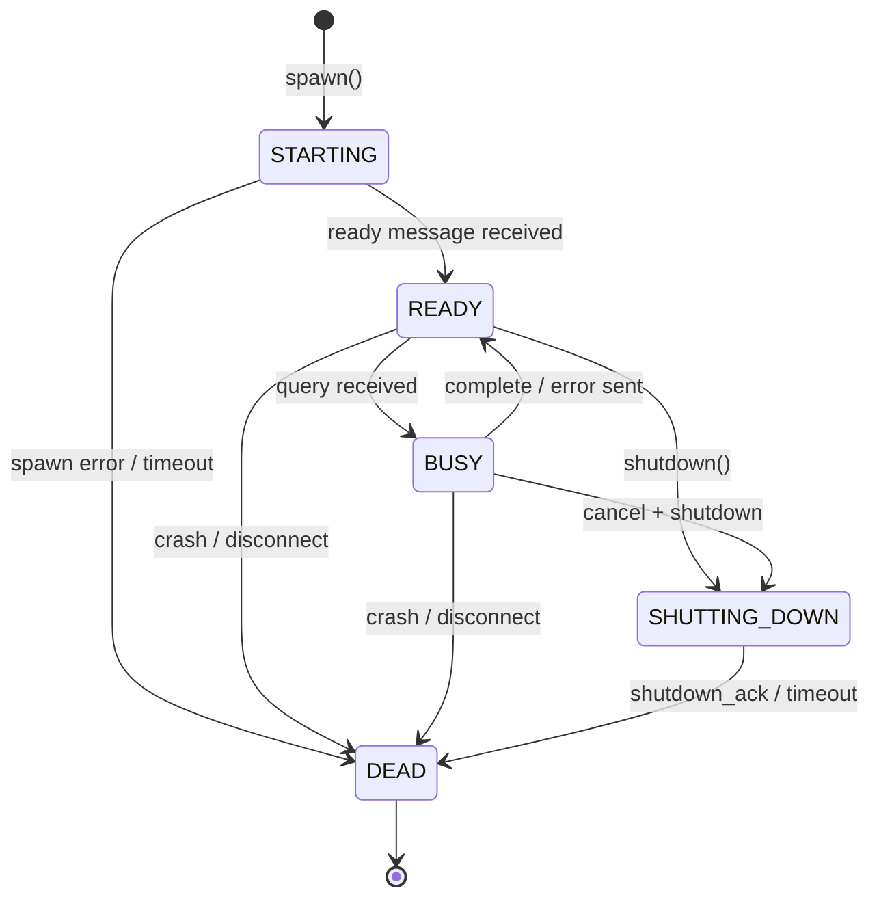
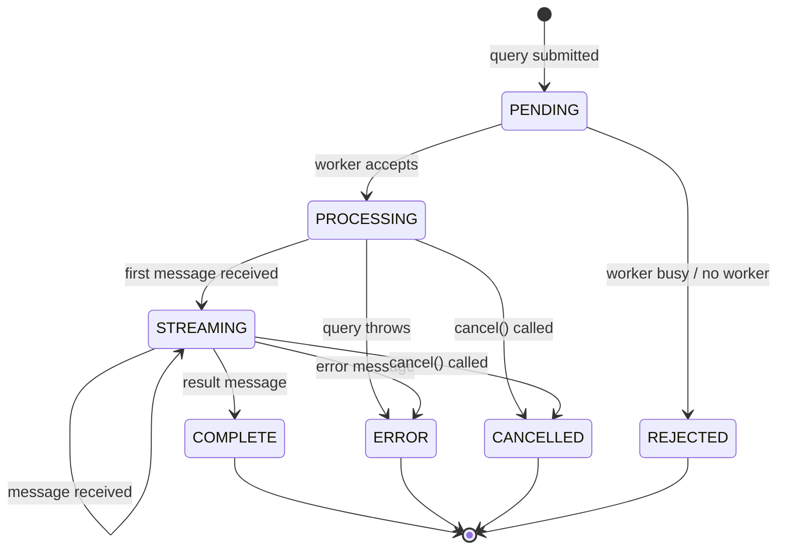
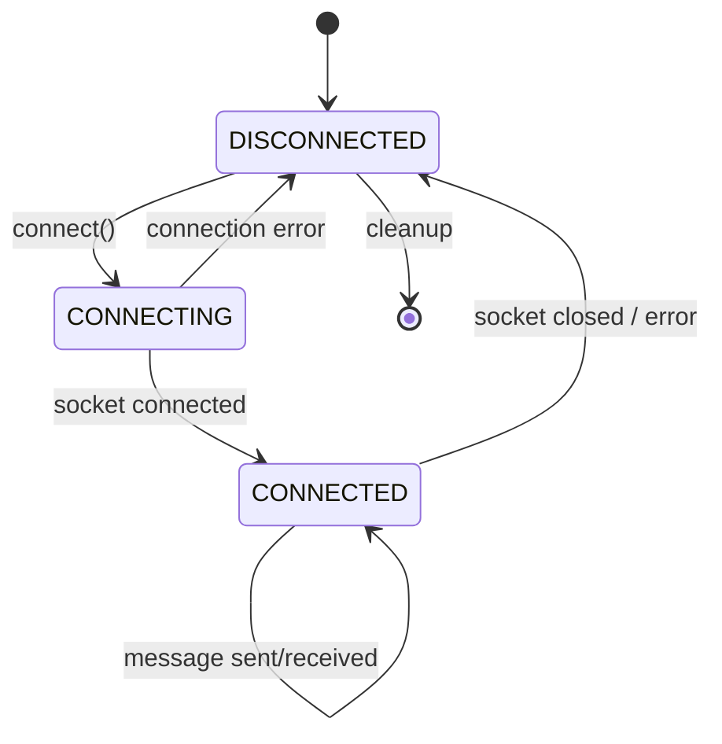
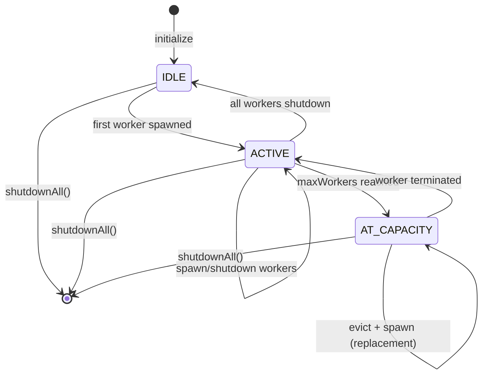

# Worker Pool State Machines

This document describes the state machines that govern the worker pool behavior.

## 1. Worker Lifecycle State Machine

Each worker process follows this state machine:



### States

| State | Description |
|-------|-------------|
| `STARTING` | Worker process spawned, waiting for IPC connection and `ready` message |
| `READY` | Worker connected and idle, can accept queries |
| `BUSY` | Worker processing a query, cannot accept new queries |
| `SHUTTING_DOWN` | Graceful shutdown in progress, waiting for current work |
| `DEAD` | Worker terminated, resources cleaned up |

### Transitions

| From | To | Trigger | Action |
|------|------|---------|--------|
| `[*]` | `STARTING` | `spawn()` called | Fork process, create IPC socket |
| `STARTING` | `READY` | `ready` message | Worker initialized, emit `worker:ready` |
| `STARTING` | `DEAD` | Timeout / error | Cleanup resources, emit `worker:crashed` |
| `READY` | `BUSY` | Query received | Set `activeRequestId`, emit `worker:busy` |
| `READY` | `SHUTTING_DOWN` | `shutdown()` | Send shutdown message |
| `READY` | `DEAD` | Crash / disconnect | Cleanup, emit `worker:crashed` |
| `BUSY` | `READY` | Complete / error | Clear `activeRequestId`, emit `worker:idle` |
| `BUSY` | `SHUTTING_DOWN` | Cancel + shutdown | Abort query, send shutdown |
| `BUSY` | `DEAD` | Crash | Parent receives disconnect, emit `worker:crashed` |
| `SHUTTING_DOWN` | `DEAD` | `shutdown_ack` | Cleanup resources |

---

## 2. Query State Machine

Each query (request) follows this state machine:



### States

| State | Description |
|-------|-------------|
| `PENDING` | Query submitted, waiting for worker assignment |
| `PROCESSING` | Worker accepted query, SDK initializing |
| `STREAMING` | Receiving messages from Claude SDK |
| `COMPLETE` | Query finished successfully |
| `ERROR` | Query failed with error |
| `CANCELLED` | Query was aborted by user |
| `REJECTED` | No worker available, query rejected |

### Message Flow

```
PENDING → PROCESSING: Worker sends session message
PROCESSING → STREAMING: First assistant/tool message
STREAMING → STREAMING: Subsequent messages (assistant, tool_use, tool_result, thinking)
STREAMING → COMPLETE: Result message with final output
```

---

## 3. IPC Connection State Machine

The Unix socket connection between parent and worker:



### States

| State | Description |
|-------|-------------|
| `DISCONNECTED` | No active socket connection |
| `CONNECTING` | Socket connection in progress |
| `CONNECTED` | Socket connected, can send/receive messages |

### Protocol (NDJSON)

Messages are newline-delimited JSON:

```
Parent → Worker:
  {"type":"query","requestId":"abc","payload":{...}}
  {"type":"cancel","requestId":"abc"}
  {"type":"shutdown","graceful":true}
  {"type":"health_check"}

Worker → Parent:
  {"type":"ready"}
  {"type":"session","requestId":"abc","sessionId":"xyz"}
  {"type":"message","requestId":"abc","content":{...}}
  {"type":"complete","requestId":"abc","result":{...}}
  {"type":"error","requestId":"abc","error":"..."}
  {"type":"shutdown_ack"}
  {"type":"health_ok","uptime":123,"queriesProcessed":5}
```

---

## 4. Pool Manager State Machine

The overall pool manager has implicit states based on capacity:



### States

| State | Description |
|-------|-------------|
| `IDLE` | No active workers |
| `ACTIVE` | 1 to (maxWorkers-1) workers active |
| `AT_CAPACITY` | maxWorkers reached, must evict to spawn new |

### Eviction Strategies

When at capacity and new worker needed:

| Strategy | Selection Criteria |
|----------|-------------------|
| `lru` | Least Recently Used (oldest `lastActivity`) |
| `oldest` | Oldest by `createdAt` timestamp |
| `least_used` | Fewest `queriesProcessed` |

---

## State Constants

These states are defined in `src/types.ts`:

```typescript
export const WORKER_STATES = {
  STARTING: "starting",
  READY: "ready",
  BUSY: "busy",
  SHUTTING_DOWN: "shutting_down",
  DEAD: "dead",
} as const

export const WORKER_MESSAGE_TYPES = {
  READY: "ready",
  SESSION: "session",
  MESSAGE: "message",
  COMPLETE: "complete",
  ERROR: "error",
  SHUTDOWN_ACK: "shutdown_ack",
  HEALTH_OK: "health_ok",
} as const

export const PARENT_MESSAGE_TYPES = {
  QUERY: "query",
  CANCEL: "cancel",
  SHUTDOWN: "shutdown",
  HEALTH_CHECK: "health_check",
} as const
```
