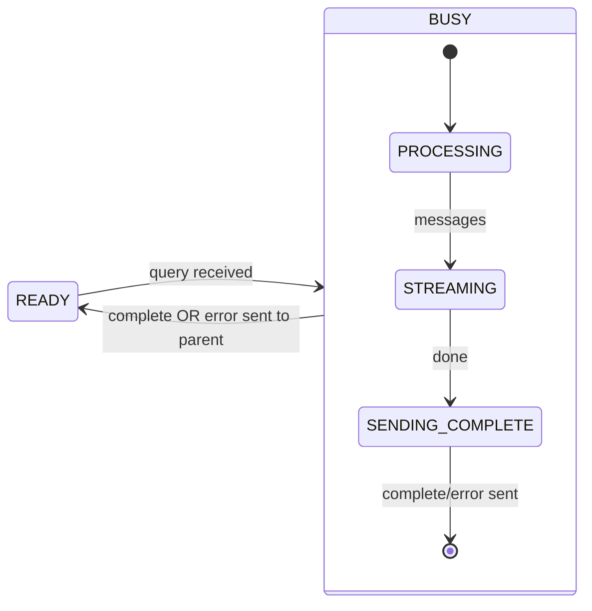
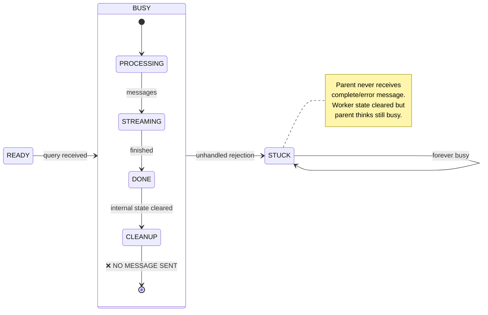
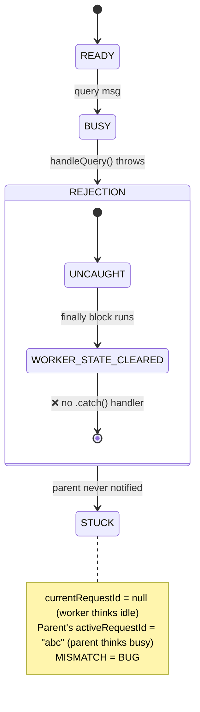
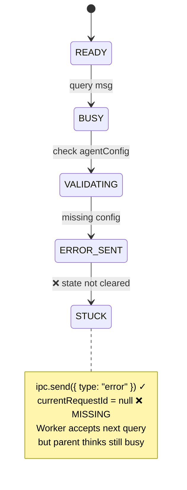
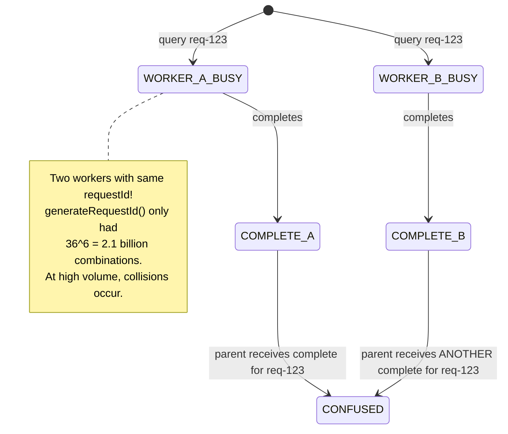
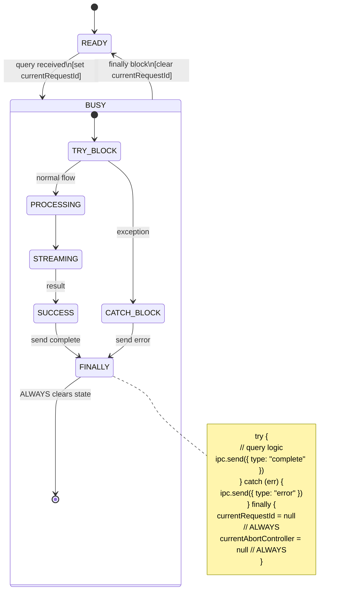

# Worker Busy Bug: State Machine Analysis

This document explains the "Worker Busy" bug that was fixed, using state machine analysis.

## The Bug

Workers would get stuck in `BUSY` state forever, rejecting all subsequent queries:
```
Error: Worker larsvandeneeden.com is busy processing request migdcncx-9jaoo5
```

## Root Cause: Missing State Transition

### Correct State Machine



**Key invariant:** Every entry to `BUSY` MUST exit via `complete` or `error` message to parent.

### Buggy State Machine (Before Fix)



## The Three Failure Modes

### 1. Unhandled Promise Rejection



**Fix:** Added `.catch()` handler:
```javascript
handleQuery(ipc, msg.requestId, msg.payload).catch((err) => {
  ipc.send({ type: "error", requestId: msg.requestId, error: err.message })
  currentRequestId = null
  currentAbortController = null
})
```

### 2. Early Return Without Cleanup



**Fix:** Clear state on early return:
```javascript
if (!agentConfig) {
  ipc.send({ type: "error", requestId, error: "Missing agentConfig" })
  currentRequestId = null      // ← Added
  currentAbortController = null // ← Added
  return
}
```

### 3. Request ID Collision



**Fix:** Use `crypto.randomUUID()`:
```javascript
export function generateRequestId(): string {
  if (crypto.randomUUID) {
    return crypto.randomUUID() // 2^122 combinations
  }
  // fallback with more entropy
}
```

## Correct Implementation: State Guards

The fixed worker guarantees state consistency:



## Invariants (Must Always Hold)

1. **Entry/Exit Parity:** Every `BUSY` entry has exactly one exit path
2. **Parent Notification:** Parent ALWAYS receives `complete` or `error` for each query
3. **State Consistency:** `currentRequestId` in worker matches `activeRequestId` in parent
4. **Unique IDs:** Request IDs never collide (use UUID)

## Test Coverage

Tests verify these invariants:

| Test | Invariant Verified |
|------|-------------------|
| `session-cookie.test.ts` | State transitions include sessionCookie |
| `ipc.test.ts` | Message types are valid |
| `integration.test.ts` | Full query lifecycle works |
| `lifecycle.test.ts` (skipped) | Error recovery clears state |

## Related Files

- `src/worker-entry.mjs` - Worker state machine implementation
- `src/manager.ts` - Parent-side worker tracking
- `src/types.ts` - State and message type constants
